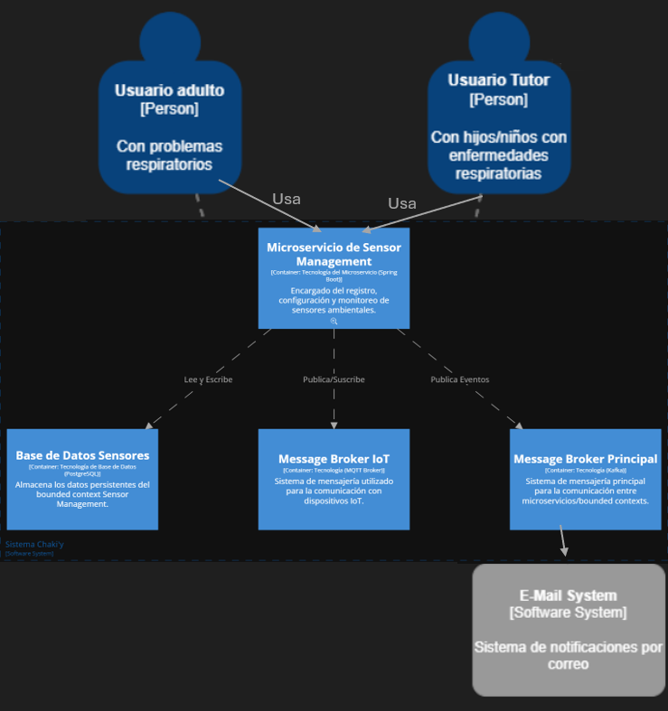

<h1 style="text-align: center;"> Informe del TF  </h1>
<h2 style="text-align: center;"> Universidad Peruana de Ciencias Aplicadas </h2>

<h4 style="text-align: center;"> Ingeniería de Software </h4>
<h4 style="text-align: center;"> Desarrollo de Soluciones IoT </h4>
<h4 style="text-align: center;"> Ciclo 2025-10 </h4>
<h4 style="text-align: center;"> Código del Curso: 1ASI0572 </h4>
<h4 style="text-align: center;"> NRC: 2952 </h4>
<h4 style="text-align: center;"> Docente: León Baca, Marco Antonio </h4>
<h4 style="text-align: center;"> Startup:  Error 404 </h4>
<h4 style="text-align: center;"> Producto: Chaki'y  </h4>

## Team Members
|             Nombre              | Código de alumno |
|:-------------------------------:|:----------------:|
|    Guillen Luna, Paolo César    |    U202124343    |
| Sebastian Nicolas, Cachis Gonzales |    U202210846    |
|   Llamo Sánchez, Amner Levi     |    U20221C376    |
|  Cantoral Paredes, Diego André  |    U20201F568    |
|       Elias Yauri Paucar        |    U202211817    |

## Registro de versiones del informe
|   Fecha    | Versión |      Autor      |                                 Descripción de modificación                                 |
|:----------:|:-------:|:---------------:|:-------------------------------------------------------------------------------------------:|
| 06/04/2024 | 1.0     |  Guillen Paolo  | Creación del documento de trabajo en formato markdown junto al realizamiento de la carátula |
| 06/04/2024 | 1.0     |  Sebastian Cachis  | Desarrollo de Hypothesis Statements y UX Canvas |
| 07/04/2024 | 1.0     |  Elias Yauri  | Desarrollo del Registro de entrevistas |
| 17/04/2024 | 1.0     |  Diego Cantoral | Desarrollo del Impact Mapping y Product Backlog |

## Project Report Collaboration Insights

URL del repositorio del proyecto: [https://github.com/Iot-Grupo2-Chakiy]

## Contenido 
1. [**Capítulo I: Introducción.**](#1.)  
1.1. [***Startup Profile***](#1.1.)  
1.1.1. [Descripción del startup](#1.1.1.) 
1.1.2.[Perfiles de los integrantes del equipo](#1.1.2.) 
1.2. [***Solution Profile***](#1.2.) 
1.2.1. [Antecedentes y Problemática](#1.2.1.) 
1.2.2. [Lean UX Process](#1.2.2.) 
1.2.2.1. [Lean UX Problem Statements](#1.2.3.) 
1.2.2.2. [Lean UX Assumptions](#1.2.4.) 
1.2.2.3. [Lean UX Hypothesis Statements](#1.2.5.) 
1.2.2.4.  [Lean UX Canvas](#1.2.5.) 
1.3. [***Segmentos objetivo***](#1.3.) 
2. [**Capítulo II: Requirements Elicitation & Analysis**](#2.) 
2.1. [***Competidores***](#2.1.) 
2.1.1. [Análisis competitivo](#2.1.1.) 
2.1.2. [Estrategias y tácticas frente a competidores](#2.1.2.) 
2.2. [***Entrevistas***](#2.2.) 
2.2.1. [Diseño de entrevistas](#2.2.1.) 
2.2.2. [Registro de entrevistas](#2.2.2.) 
2.2.3. [Análisis de entrevistas](#2.2.3.) 
2.3. [***Needfinding***](#2.3.) 
2.3.1. [User Personas](#2.3.1.) 
2.3.2. [User Task Matrix](#2.3.2.) 
2.3.3. [User Journey Mapping](#2.3.3.) 
2.3.4. [Empathy Mapping](#2.3.4.) 
2.3.5. [As-is Scenario Mapping](#2.3.5.) 
2.4. [***Ubiquitous Language***](#2.4.) 
3. [**Capítulo III: Requirements Specification**](#3.) 
3.1. [***To-Be Scenario Mapping***](#3.1.) 
3.2. [***User Stories***](#3.2.) 
3.3. [***Impact Mapping***](#3.3.) 
3.4. [***Product Backlog***](#3.4.) 
4. [**Capítulo IV: Solution Software Design**](#4.) 
4.1. [***Strategic-Level Domain-Driven Design***](#4.1.) 
4.1.1. [EventStorming](#4.1.1.) 
4.1.1.1. [Candidate Context Discovery](#4.1.1.1.) 
4.1.1.2. [Domain Message Flows Modeling](#4.1.1.2.) 
4.1.1.3. [Bounded Context Canvases](#4.1.1.3.) 
4.1.2. [Context Mapping](#4.1.2.) 
4.1.3. [Software Architecture](#4.1.3.) 
4.1.3.1. [Software Architecture System Landscape Diagram](#4.1.3.1.) 
4.1.3.2. [Software Architecture Context Level Diagrams](#4.1.3.2.) 
4.1.3.3. [Software Architecture Container Level Diagrams](#4.1.3.3.) 
4.1.3.4. [Software Architecture Deployment Diagrams](#4.1.3.4.) 
4.2. [***Tactical-Level Domain-Driven Design***](#4.2.) 
4.2.1. [Bounded Context: &lt;Bounded Context Name&gt;](#4.2.1.) 
4.2.1.1. [Domain Layer](#4.2.1.1.) 
4.2.1.2. [Interface Layer](#4.2.1.2.) 
4.2.1.3. [Application Layer](#4.2.1.3.) 
4.2.1.4. [Infrastructure Layer](#4.2.1.4.) 
4.2.1.5. [Bounded Context Software Architecture Component Level Diagrams](#4.2.1.5.) 
4.2.1.6. [Bounded Context Software Architecture Code Level Diagrams](#4.2.1.6.) 
4.2.1.6.1. [Bounded Context Domain Layer Class Diagrams](#4.2.1.6.1.) 
4.2.1.6.2. [Bounded Context Database Design Diagram](#4.2.1.6.2.) 

8. [**Conclusiones**](#8.) 
9. [**Bibliografía**](#9.) 
10. [**Anexos**](#10.) 

<h2>Capítulo I: Introducción</h2>

<h3> 1.1 Startup Profile</h3>

En esta sección se presenta la descripción del startup y los perfiles de los miembros del equipo.

<h4> 1.1.1. Descripción del startup</h4>

Nuestra startup, Error 404, tiene como misión ofrecer soluciones digitales innovadoras que mejoren la calidad de vida de las personas. A diferencia de otras empresas tecnológicas que apuntan exclusivamente a grandes corporativos, nosotros tenemos una visión inclusiva: queremos ser la opción para todos, desde personas que recién descubren el mundo digital hasta usuarios avanzados que buscan herramientas eficientes para facilitar su día a día.

Para lograrlo, desarrollamos plataformas y dispositivos inteligentes basados en tecnologías como el Internet de las Cosas (IoT) y automatización, con el objetivo de resolver problemas cotidianos de manera práctica y accesible. Creemos que la tecnología no solo debe ser funcional, sino también humana, cercana y útil para el bienestar integral.

**Misión:** . Desarrollar soluciones digitales innovadoras que utilicen tecnologías emergentes, como IoT, para mejorar la calidad de vida de las personas, promoviendo la inclusión tecnológica en todos los niveles de la sociedad.

**Visión:** . Error 404 aspira a convertirse en una startup referente en soluciones tecnológicas aplicadas a la vida cotidiana, reconocida por su capacidad de innovación, su impacto social positivo y su compromiso con una tecnología centrada en las personas.

<h4> 1.1.2. Perfiles de los integrantes del equipo</h4>

|                                                                                                                                                                                                          Descripción de los perfiles de los integrantes del equipo                                                                                                                                                                                                           |                                                              Foto del integrante                                                              |
|:----------------------------------------------------------------------------------------------------------------------------------------------------------------------------------------------------------------------------------------------------------------------------------------------------------------------------------------------------------------------------------------------------------------------------------------------------------------------------:|:---------------------------------------------------------------------------------------------------------------------------------------------:|
| Mi nombre es **Paolo César Guillen Luna**, estudiante de la carrera de Ingeniería de Software, en la UPC y fanático de los videojuegos. Me considero alguien creativo y con determinación en alcanzar sus metas, dentro del campo del desarrollo de software, me gustaría especializarme en lo que es el testing de este, razón por la cual aparte de seguir la malla curricular de mi carrera también ando aprendiendo herramientas diversas como Playwright, Cypress, etc. |      |
| Mi nombre es **Diego André Cantoral Paredes** y soy estudiante de la carrera de Ingeniería de Software. Desde siempre me interesaron los temas tecnológicos y sobre todo las computadoras, por lo que desarrollé una afición a los videojuegos y luego a la programación. Me considero una persona responsable, creativa y siempre dispuesto a ayudar a mis compañeros.|      |
|Mi nombre es **Amner Levi Llamo Sánchez**, soy estudiante del septimo ciclo de ingeniería de software en la UPC. Me gusta jugar fútbol y videojuegos, por eso estoy constantemente investigando sobre nuevas tecnologías. Soy responsable con los trabajos que se me asignan; además soy tolerante y me adapto a las circunstancias del equipo.||
|Mi nombre es **Sebastian Nicolas Cachis Gonzales**, soy estudiante de séptimo ciclo de ingeniería de software en la UPC. Me considero una persona proactiva, organizada, meticulosa y muy enfocada en mis estudios, tanto grupales como individuales. Tengo facilidad para entender y ejemplificar los distintos temas que vemos, teniendo soltura para explicar. |  |
| Mi nombre es **Elias Yauri**, soy una persona muy participativa cuando se trata en el tema laboral y en el trabajo en equipo, siempre trato de que haya una comunicación constante con todos los miembros del grupo para que de esta forma podamos tener toda una buena afinidad como grupo y que el trabajo se realice de manera exitosa.  |  |

<h3> 1.2. Solution Profile</h3>

<h4> 1.2.1. Antecedentes y Problemática</h4>

##### What (Qué)
###### ¿Cuál es el problema?
El problema radica en la falta de soluciones accesibles, automatizadas y personalizadas para controlar las condiciones ambientales dentro del hogar, especialmente en habitaciones de personas —niños y adultos— que padecen asma u otras enfermedades respiratorias. Aunque existen dispositivos como deshumidificadores o purificadores, la mayoría no se integran en un sistema inteligente que permita su activación automática basada en datos reales. Esto dificulta mantener un ambiente seguro, especialmente en hogares donde los cuidadores no siempre están presentes o los adultos llegan cansados del trabajo y requieren un espacio saludable para descansar.

##### When (Cuando)
###### ¿Cuándo sucede el problema?
Este problema se presenta en cualquier momento del día, pero es más crítico durante temporadas de alta humedad o contaminación ambiental, y en horarios en los que el hogar se encuentra sin supervisión directa. También ocurre cuando adultos con asma regresan de una jornada laboral o actividades extenuantes y necesitan descansar en un entorno propicio para su condición respiratoria.

##### Where (Dónde)
###### ¿A dónde se dirige?
Nuestra solución se dirige tanto a familias con niños asmáticos como a adultos que necesitan un entorno saludable tras sus actividades diarias, sin importar su nivel técnico. Se busca facilitar el acceso a un ambiente controlado mediante el uso de tecnología IoT a través de una app web o móvil.

###### ¿Dónde surge el problema?
El problema se origina dentro de los hogares, especialmente en dormitorios o salas donde habitan personas con condiciones respiratorias.

##### Who (Quién)
###### ¿Quiénes están involucrados? ¿Quién lo utilizará?
Los principales usuarios son padres o cuidadores de niños asmáticos, así como adultos que padecen asma u otras afecciones respiratorias y requieren un ambiente controlado. También se incluye a médicos que podrían recomendar el uso de este sistema. El objetivo es brindar autonomía, seguridad y comodidad a quienes sufren estas condiciones, incluso cuando están solos en casa.

##### Why (Por qué)
###### ¿Cuál es la causa del problema?
La principal causa es la ausencia de herramientas automatizadas y accesibles que se integren de forma sencilla al hogar y que brinden monitoreo ambiental en tiempo real. Muchas personas siguen confiando en métodos tradicionales, lo que retrasa la adopción de tecnologías que podrían mejorar considerablemente su calidad de vida. En el caso de adultos trabajadores, muchas veces no tienen el tiempo o energía para gestionar manualmente su entorno cada día.

#### 2H
##### How (Cómo)
###### ¿Cómo se utilizará el producto?
El producto consistirá en una plataforma web/móvil desde la cual el usuario podrá monitorear la temperatura, humedad y calidad del aire de una habitación en tiempo real. Con base en estos datos —recopilados mediante sensores IoT—, se enviarán notificaciones y se activarán automáticamente dispositivos como deshumidificadores, purificadores o extractores de aire. También será posible configurarlo manualmente y personalizarlo según las rutinas del usuario (por ejemplo, que active el sistema antes de que un adulto llegue a casa del trabajo).

###### ¿Cómo se logrará una gestión adecuada del ambiente?
Por medio de sensores IoT distribuidos estratégicamente en la habitación. Estos enviarán datos constantes al sistema, que interpretará los valores y ejecutará acciones en tiempo real. Además, la app brindará recomendaciones basadas en guías médicas (por ejemplo, cuándo ventilar el ambiente, evitar plantas o textiles que acumulen polvo, etc.).

##### How much (Cuánto)
###### ¿Cuál es la magnitud del problema?
La OMS estima que más de 339 millones de personas en el mundo padecen asma, de los cuales una gran parte son adultos que necesitan entornos estables para mantener su salud respiratoria. En Latinoamérica, se estima que entre el 10% y 15% de niños y adultos presentan asma. Además, el 80% de los casos en países en desarrollo se agravan por falta de control ambiental en casa.

Si nuestra solución logra implementarse en solo el 30% de los hogares con personas asmáticas en regiones urbanas, podríamos tener un impacto significativo en la reducción de crisis respiratorias, visitas médicas, y mejorar el descanso diario de los usuarios.

<h4> 1.2.2. Lean UX Process</h4>

<h5> 1.2.2.1. Lean UX Problem Statements</h5>

##### **Problem Statement:** 
Nuestra plataforma, desarrollada por la startup Error 404, nace con el objetivo de brindar soluciones digitales innovadoras que mejoren la calidad de vida de las personas a través de la tecnología. En esta etapa, nos enfocamos en las personas que conviven con enfermedades respiratorias como el asma —tanto niños como adultos— y que requieren de un ambiente saludable y controlado dentro del hogar.

Hoy en día, muchas familias no cuentan con los conocimientos, herramientas o tiempo para controlar adecuadamente las condiciones ambientales de sus hogares. Aunque existen deshumidificadores y purificadores de aire, la falta de integración tecnológica, el monitoreo en tiempo real y la automatización limita su efectividad y uso constante. Además, los adultos que retornan del trabajo o de sus actividades buscan un espacio tranquilo y seguro para subsistir con su condición, pero muchas veces no encuentran el entorno ideal al llegar a casa.

Por otro lado, el desconocimiento sobre la humedad, temperatura o calidad del aire en tiempo real puede desencadenar crisis respiratorias que podrían haberse evitado con alertas o respuestas automáticas del entorno. El reto entonces es: ¿Cómo podemos ofrecer una solución automatizada, intuitiva y confiable que permita a las personas con condiciones respiratorias controlar el ambiente de su hogar, sin necesidad de conocimientos técnicos, y que además funcione de manera preventiva?

Para abordar esta pregunta, necesitamos centrarnos en las siguientes directrices:

* Enfoque centrado en el usuario: La solución debe ser extremadamente fácil de usar, accesible tanto para padres y madres como para adultos mayores o personas con bajo nivel tecnológico.
* Alcance claro: Nos centraremos en la gestión del ambiente del hogar (humedad, temperatura y calidad del aire), excluyendo otros factores como el control médico o diagnóstico clínico.
* Medidas de éxito: El éxito se medirá por la reducción en los episodios respiratorios relacionados al ambiente, el aumento del confort de los usuarios al llegar a casa, y la adopción sostenida de la herramienta por parte de las familias
* Al plantear esta necesidad de forma abierta, dejamos espacio para explorar soluciones que integren tecnología IoT, interfaces amigables, automatización y educación preventiva. Lo fundamental es asegurar que la solución no solo funcione, sino que también genere confianza y se perciba como un verdadero apoyo en la vida diaria de quienes viven con asma.

##### **User Assumptions:**
###### **¿Quién es el usuario?**

El usuario de nuestro producto son personas con asma o afecciones respiratorias, principalmente niños que necesitan un ambiente saludable en el hogar y adultos que, tras una jornada laboral o de actividades, buscan un espacio adecuado para descansar y cuidar su salud. En muchos casos, los usuarios también son padres o cuidadores que desean garantizar un entorno óptimo para sus hijos. Si el producto tiene éxito, también podría ser adoptado por instituciones como centros educativos, clínicas o residencias.

###### **¿Qué problemas tiene nuestro producto? ¿Qué resuelve?**

El problema central que aborda nuestro producto es la falta de monitoreo y control en tiempo real de las condiciones ambientales dentro del hogar, lo cual puede desencadenar crisis respiratorias en personas con asma. Nuestra solución utiliza tecnología IoT para detectar niveles no adecuados de humedad o temperatura y automatizar la activación de deshumidificadores u otros dispositivos, todo controlado desde una aplicación web o móvil accesible y fácil de usar.

###### **¿Qué características son importantes?**

Entre las características más relevantes se encuentran:

- **Automatización del ambiente** mediante sensores IoT.
- **Control remoto** de dispositivos como deshumidificadores desde una app web/móvil.
- **Alertas inteligentes** cuando los niveles de humedad o temperatura no son óptimos.
- **Historial de condiciones ambientales** para prevenir futuras crisis.
- **Accesibilidad y facilidad de uso**, sin requerir conocimientos técnicos.

###### **¿Dónde encaja nuestro producto en su trabajo o vida?**

Nuestro producto encaja directamente en la rutina diaria del usuario, ya que mejora significativamente el ambiente del hogar. Ayuda a garantizar que, al volver a casa luego del trabajo o al cuidar de un niño, el entorno esté adaptado para evitar complicaciones respiratorias. También se integra como una herramienta de apoyo constante, tanto en situaciones preventivas como reactivas.

###### **¿Cuándo y cómo es nuestro producto usado?**

El sistema puede usarse de manera automática cuando los sensores detectan condiciones desfavorables o manualmente cuando el usuario desea preparar el ambiente (por ejemplo, antes de llegar a casa). El uso puede ser frecuente, especialmente en horas clave como la noche, el amanecer o tras actividades físicas que agraven síntomas respiratorios.

###### **¿Cómo debe verse nuestro producto y cómo debe comportarse?**

Debe tener una interfaz amigable, clara y empática, con diseño pensado para personas de todas las edades. Su comportamiento debe ser predecible, proactivo y seguro: debe actuar ante riesgos ambientales, proteger los datos del usuario y permitir una experiencia sin frustraciones. Además, debe transmitir confianza y tranquilidad en todo momento.

<h5> 1.2.2.2. Lean UX Assumptions.</h5>

##### **Feature Assumptions:**

**Creemos que** al integrar sensores de calidad del aire y humedad, los usuarios podrán evitar crisis asmáticas antes de que ocurran, mejorando su calidad de vida.

**Creemos que** al permitir el encendido remoto de deshumidificadores, los usuarios podrán preparar el ambiente antes de llegar a casa, asegurando un entorno saludable desde el inicio.

**Creemos que** incluir un historial ambiental ayudará a identificar patrones que afectan la salud respiratoria y tomar decisiones preventivas más informadas.

**Creemos que** una sección educativa con consejos y guías sobre cómo mantener un ambiente saludable fomentará una comunidad más informada y comprometida con el autocuidado.

**Creemos que** implementar un sistema de alertas en tiempo real ante condiciones críticas permitirá respuestas rápidas que prevengan crisis respiratorias, especialmente en niños.

<h5> 1.2.2.3. Lean UX Hypothesis Statements.</h5>

Hipótesis 1: Sensores para evitar crisis asmáticas

**Creemos que** al integrar sensores de calidad del aire y humedad en el hogar, los usuarios podrán evitar crisis asmáticas antes de que ocurran, mejorando su calidad de vida.
**Sabremos que hemos tenido éxito cuando** los usuarios reporten una disminución en la frecuencia de crisis respiratorias y manifiesten sentirse más seguros en sus hogares.

Hipótesis 2: Encendido remoto del sistema

**Creemos que** al permitir el encendido remoto de deshumidificadores y otros dispositivos, los usuarios podrán preparar el ambiente antes de llegar a casa, asegurando un entorno saludable desde el inicio.
**Sabremos que hemos tenido éxito cuando** los usuarios utilicen frecuentemente esta función y expresen satisfacción con las condiciones del ambiente al llegar a casa.

Hipótesis 3: Historial de condiciones ambientales

**Creemos que** al incluir un historial de condiciones ambientales, los usuarios podrán identificar patrones que afectan su salud respiratoria y tomar decisiones preventivas más informadas.
**Sabremos que hemos tenido éxito cuando** los usuarios consulten regularmente el historial y realicen ajustes en sus rutinas o configuraciones basados en los datos registrados.

Hipótesis 4: Contenido educativo dentro de la app

**Creemos que** incluir una sección educativa con consejos y guías fomentará una comunidad más informada y comprometida con el autocuidado.
**Sabremos que hemos tenido éxito cuando** los usuarios accedan frecuentemente a esta sección y demuestren cambios positivos en sus hábitos relacionados al ambiente del hogar.

Hipótesis 5: Alertas en tiempo real

**Creemos que** implementar un sistema de alertas en tiempo real ante condiciones críticas permitirá respuestas rápidas que prevengan crisis respiratorias, especialmente en niños.
**Sabremos que hemos tenido éxito cuando** los usuarios reaccionen ante las alertas y estas acciones se correlacionen con una disminución en episodios respiratorios reportados.

<h5> 1.2.2.4. Lean UX Canvas.</h5>

<h3> 1.3. Segmento Objetivo</h3>

Adultos que sufren de asma o afecciones respiratorias: Personas que necesitan un entorno controlado y saludable en su hogar para mejorar su calidad de vida y reducir los síntomas relacionados con el asma.

Niños y padres de niños con asma, así como personas que padecieron asma en su niñez: Padres o cuidadores que buscan garantizar un ambiente seguro y saludable para sus hijos, o adultos que vivieron con asma durante su infancia y desean mantener un entorno controlado para prevenir futuros episodios.

<h2>Capítulo II: Requirements Elicitation & Analysis</h2>

<h3> 2.1 Competidores</h3>

||Chaki'y |AirVisual  |Awair |Nest Thermostat (Google) |
|:-:|:-:|:-:|:-:|:-:|
|**Overview**|Solución IoT para controlar el aire, humedad y temperatura en hogares de personas con asma.	|Sensor de calidad del aire para monitorear contaminación y condiciones ambientales.	|Dispositivo IoT para monitorear y controlar la calidad del aire y el ambiente en el hogar.	|Termostato inteligente que regula temperatura y humedad para optimizar el hogar.|
|**Ventajas Competitivas**|Proporciona un control automático y preventivo del ambiente para mejorar la salud respiratoria de personas con asma.	|Ofrece monitoreo en tiempo real de la calidad del aire para crear un ambiente más saludable.|Brinda control y monitoreo del ambiente para mejorar el bienestar general del hogar.	|Regula temperatura y humedad de manera inteligente, optimizando el confort y la eficiencia energética.|
|**Mercado Objetivo**|Familias con niños asmáticos, adultos con asma y cuidadores.	|Personas preocupadas por la calidad del aire, en áreas urbanas o contaminadas.	|Hogares interesados en bienestar ambiental y calidad del aire.	|Propietarios que buscan eficiencia energética y automatización del hogar.|
|**Estrategias de Marketing**|Educación sobre salud respiratoria, alianzas con médicos, marketing en redes sociales.	|Publicidad en plataformas de sostenibilidad, contenido sobre calidad del aire.	|Influencers en bienestar, campañas sobre aire en interiores.	|Publicidad sobre eficiencia energética e integración con ecosistema Google.|
|**Productos & Servicios**|Plataforma IoT para control ambiental, integración con deshumidificadores y purificadores.	|Sensor con app para datos de contaminación, temperatura y humedad.	|Dispositivo con app para control del aire, temperatura y humedad.|Termostato inteligente con integración smart home.|
|**Precios & Costos**|~$140 (incluye sensores y deshumidificador).	|~$199	|~$199	|~$130|
|**Canales de distribución (WEB y/o Móvil)**|Plataforma web y móvil para monitoreo ambiental en hogares.	|App móvil para monitoreo ambiental en tiempo real.	|Plataforma web y móvil para monitoreo del aire.	|Plataforma web y móvil para control inteligente del hogar.|
|**Fortalezas**|Monitoreo ambiental completo para personas con afecciones respiratorias.	|Alertas en tiempo real y recomendaciones de salud ambiental.	|Información en tiempo real sobre calidad del aire interior.	|Control eficiente de temperatura y humedad vía app.|
|**Debilidades**|Dependencia de conectividad y dispositivos adicionales.	|Dependencia de red de sensores y posible dificultad de uso de la app.	|Limitado en procesamiento de datos, precio elevado.	|Requiere Wi-Fi y puede no ser compatible con todos los sistemas HVAC.|
|**Oportunidades**|Expansión en mercados con alta prevalencia de asma, nuevos sensores, alianzas con salud.	|Conciencia creciente sobre contaminación, expansión internacional.	|Mayor demanda de soluciones ambientales, alianzas con salud y bienestar.	|Expansión de hogares inteligentes, integración IoT.|
|**Amenazas**|Alta competencia IoT en salud, barreras tecnológicas.	|Competidores avanzados, percepción de precio alto.	|Nuevos competidores con soluciones más baratas o avanzadas.	|Competencia con opciones más económicas, problemas de compatibilidad.|

<h4> 2.1.1. Análisis competitivo</h4>

Chaki'y se diferencia de sus competidores al integrar IoT para monitorear y automatizar dispositivos como deshumidificadores y purificadores, mejorando la calidad del aire y la temperatura en el hogar de personas con afecciones respiratorias. A diferencia de AirVisual y Awair, que se centran solo en el monitoreo de la calidad del aire, Chaki'y ofrece una solución más completa al automatizar la respuesta a los cambios ambientales. Nest Thermostat, aunque optimiza la temperatura y la eficiencia energética, no está diseñado para abordar específicamente las necesidades de personas con afecciones respiratorias.

El mercado objetivo de Chaki'y está enfocado en personas con afecciones respiratorias, como niños y adultos con asma, y sus cuidadores. En contraste, AirVisual y Awair están dirigidos a usuarios interesados en la calidad del aire en general, sin un enfoque especializado en problemas respiratorios. Nest Thermostat está destinado a quienes buscan eficiencia energética, pero no se centra en las necesidades de los usuarios con problemas respiratorios.

En términos de precios, Chaki'y ofrece una versión gratuita que facilita su acceso a un público más amplio, mientras que los competidores AirVisual, Awair y Nest Thermostat son productos premium, lo que limita su accesibilidad. Chaki'y tiene una ventaja competitiva al ser más accesible, especialmente para aquellos que no están seguros de realizar una inversión inicial.

Chaki'y tiene una gran oportunidad de capitalizar su enfoque especializado en afecciones respiratorias y su integración con dispositivos IoT para crear un ambiente más saludable. Aunque AirVisual y Awair son productos avanzados en el monitoreo del aire, la automatización de Chaki'y le da una ventaja clara. Nest Thermostat, con su enfoque en eficiencia energética, representa una amenaza, pero su falta de enfoque en la calidad del aire lo hace menos adecuado para personas con afecciones respiratorias. En general, Chaki'y está bien posicionado para liderar este nicho de mercado.

<h4> 2.1.2. Estrategias y tácticas frente a competidores</h4>

Chaki'y debe destacarse de sus competidores como AirVisual, Awair y Nest Thermostat mediante su diferenciación como una solución IoT integral para la mejora de la calidad del aire y el control de la temperatura, orientada específicamente a personas con afecciones respiratorias. Su enfoque en automatizar dispositivos como deshumidificadores y purificadores, junto con su modelo accesible de precios, la posiciona como una alternativa más completa frente a competidores que solo ofrecen monitoreo. Además, Chaki'y debe continuar promoviendo su nicho de mercado, centrado en el bienestar respiratorio, y utilizar estrategias de precios con opciones gratuitas y premium para atraer a una mayor variedad de usuarios.

En cuanto a las tácticas, Chaki'y debería centrarse en campañas educativas sobre la importancia de la calidad del aire, aprovechar alianzas estratégicas con organizaciones de salud para aumentar su credibilidad, y continuar invirtiendo en la automatización de su tecnología. También puede incentivar la adopción a través de pruebas gratuitas y aprovechar testimonios de usuarios satisfechos. Finalmente, debe desarrollar campañas de marketing dirigidas específicamente a personas con afecciones respiratorias, destacando cómo su solución mejora la calidad de vida de los usuarios. Estas estrategias permitirán a Chaki'y competir eficazmente en el mercado, atraer a nuevos usuarios y fortalecer su posición frente a competidores.

<h3> 2.2 Entrevistas</h3>

<h4> 2.2.1. Diseño de entrevistas</h4>

  
En esta sección se procederá a detallar las preguntas para el método de recoleccion de
  requisitos que son las entrevistas. Para la formulación se siguieron buenas prácicas tales como 
  formulación de preguntas abiertas, así mismo obtenemos características demográficas con las entrevistas
  

  <h4>PREGUNTAS GENERALES</h4>
  
Bienvenido gracias por brindarnos esta entrevista (empieza con las preguntas generales) 

  
  * Nos gustaría saber su nombre, edad y ocupación
  * ¿Qué tan acostumbrado está con el uso de tecnología en su vida diaria?
  * Dentro de su vida diaria, ¿tiene incovenientes utilizando dichas herramientas digitales?
  * Alguna vez tuvo que enfrentarse con una situación donde usted no entendía para nada como servía una aplicación, de ser así, ¿cómo sobrellevo ese problema?
    
### Segmento 1: Adultos que sufren de asma o problemas respiratorios

1. ¿Cuánto tiempo hace que tienes asma o alguna afección respiratoria?
2. ¿Cómo manejas tus síntomas asmáticos a lo largo del día?
3. ¿Qué herramientas o dispositivos usas actualmente para controlar el ambiente de tu hogar (temperatura, humedad, calidad del aire)?
4. ¿Con qué frecuencia te encuentras con crisis asmáticas o problemas respiratorios debido a factores ambientales?
5. ¿Crees que el monitoreo de la calidad del aire y la temperatura en tu hogar ayudaría a reducir tus síntomas?
6. ¿Estarías dispuesto a usar una aplicación móvil que controle la calidad del aire y la temperatura de tu hogar?
7. ¿Qué características valoras más en una herramienta que te ayude a gestionar tu condición respiratoria?
8. ¿Cómo te sentirías al integrar dispositivos inteligentes en tu hogar para mejorar tu salud respiratoria?
9. ¿Estarías dispuesto a pagar por una herramienta como Chaki'y si mejora tu calidad de vida?

### Segmento 2: Niños/Padres con niños que sufren de asma o personas que sufrieron de asma en su niñez

1. ¿Recuerdas cómo tus padres manejaron las crisis asmáticas que tuviste en la niñez?
2. ¿Qué tipo de soluciones usaban tus padres para mejorar la calidad del aire en tu hogar durante esos episodios?
3. ¿Crees que los padres de hoy enfrentan los mismos retos para controlar el asma de sus hijos que los padres de tu generación?
4. ¿Crees que una herramienta como Chaki'y, que monitorea el aire y la temperatura, sería útil para los padres de niños asmáticos hoy en día?
5. ¿Cómo manejabas el control de tu salud respiratoria cuando eras más joven? ¿Qué tecnología utilizabas (si alguna)?
6. ¿Qué opinas de las soluciones tecnológicas actuales para el control del asma infantil?
7. ¿Estarías dispuesto a usar una aplicación móvil como Chaki'y para monitorear la calidad del aire en casa de tus hijos?
8. ¿Qué características consideras más importantes en una herramienta que los padres puedan usar para gestionar la salud respiratoria de sus hijos?
9. ¿Crees que los padres actuales estarían dispuestos a pagar por un dispositivo o aplicación que controle el ambiente de su hogar y mejore la salud respiratoria de sus hijos?

<h4> 2.2.2. Registro de entrevistas</h4>

***Adultos que sufren de asma o problemas respiratorios***

|Nombre entrevistado|Rodrigo Pisconti|
|-|-|
|Edad|20 años|
|Departamento|Ica, Ica|
||Rodrigo Pisconti, un joven de 20 años que sufrió de asma durante su niñez, actualmente sigue siendo sensible a factores ambientales como la humedad y el polvo. Aunque sus síntomas se han reducido, aún experimenta molestias respiratorias varias veces al mes. Usa un deshumidificador y medidores manuales de ambiente, pero no cuenta con tecnología automatizada. Mostró interés en una herramienta que le permita monitorear y controlar el ambiente de su hogar de forma preventiva. Destaca la importancia de la simplicidad, confiabilidad y automatización. Rodrigo se mostró dispuesto a integrar dispositivos inteligentes y pagar por una solución como Chaki’y si mejora su bienestar.|
|Duración entrevista: 00:00-05:38 |URL: [https://upcedupe-my.sharepoint.com/:v:/g/personal/u202124343_upc_edu_pe/EZqPk9U6F3lOpU7ug6LkzagBSg0eIYig1s75ae5wlq_9zQ?nav=eyJyZWZlcnJhbEluZm8iOnsicmVmZXJyYWxBcHAiOiJPbmVEcml2ZUZvckJ1c2luZXNzIiwicmVmZXJyYWxBcHBQbGF0Zm9ybSI6IldlYiIsInJlZmVycmFsTW9kZSI6InZpZXciLCJyZWZlcnJhbFZpZXciOiJNeUZpbGVzTGlua0NvcHkifX0&e=YEqaMj]|

|Nombre entrevistado|Gian Sánchez|
|Edad|25 años|
|Departamento|Lima, Lima|
||Gian Sánchez, de 25 años, padece asma desde los 14. Aunque al inicio sus síntomas eran leves, con el tiempo se han intensificado, especialmente durante la limpieza o en ambientes laborales donde no se conoce su condición. Para manejar sus síntomas, usa inhalador, toma medicación diaria y evita ambientes con polvo o humo. Actualmente utiliza un deshumidificador y un purificador de aire en su dormitorio, pero aun así experimenta crisis respiratorias dos o tres veces al mes, y episodios más severos entre tres y cuatro veces al año, generalmente relacionados con la contaminación o cambios bruscos de clima.Le pareció muy interesante la propuesta de Chaki’y, ya que considera que el monitoreo y la automatización del ambiente serían de gran ayuda. Comenta que muchas veces no percibe los cambios en el entorno hasta que aparecen los síntomas, por lo que valora recibir notificaciones y que el sistema actúe automáticamente. Está dispuesto a usar una aplicación móvil para este fin, siempre que sea confiable, fácil de usar y configurable. Además, señaló que estaría dispuesto a invertir en una herramienta como Chaki’y si contribuye a mejorar su calidad de vida.|
|Duración entrevista: 05:38-10:41 |URL: [https://upcedupe-my.sharepoint.com/:v:/g/personal/u202124343_upc_edu_pe/EZqPk9U6F3lOpU7ug6LkzagBSg0eIYig1s75ae5wlq_9zQ?nav=eyJyZWZlcnJhbEluZm8iOnsicmVmZXJyYWxBcHAiOiJPbmVEcml2ZUZvckJ1c2luZXNzIiwicmVmZXJyYWxBcHBQbGF0Zm9ybSI6IldlYiIsInJlZmVycmFsTW9kZSI6InZpZXciLCJyZWZlcnJhbFZpZXciOiJNeUZpbGVzTGlua0NvcHkifX0&e=YEqaMj]|

|Nombre entrevistado|Brian Cruz|
|-|-|
|Edad|22 años|
|Departamento|Lima, Lima|
||Brian es un estudiante universitario de 22 años, nos comenta que sufre de problemas de respiratorios desde niño como el asma, sin embargo a medido que fue creciendo solo le quedaron secuelas de este así que aún debe tomar sus prevenciones, nos cuenta que al vivir con una agenda ajetreada entre trabajo y estudio, hay veces en las que debe descansar en su hogar y debe prender manualmente su deshumidificador cada vez que llega del trabajo/estudio, al mencionarle sobre Chaki'y, este nos menciona que una solución así podría ser útil y que entiende que podría ser algo costoso por el tema de la tecnología IoT con la que cuenta, pero que alegremente estaría dispuesto a usarla |
|Duración entrevista: 10:41 - 19:22     |URL: [https://upcedupe-my.sharepoint.com/:v:/g/personal/u202124343_upc_edu_pe/EZqPk9U6F3lOpU7ug6LkzagBSg0eIYig1s75ae5wlq_9zQ?nav=eyJyZWZlcnJhbEluZm8iOnsicmVmZXJyYWxBcHAiOiJPbmVEcml2ZUZvckJ1c2luZXNzIiwicmVmZXJyYWxBcHBQbGF0Zm9ybSI6IldlYiIsInJlZmVycmFsTW9kZSI6InZpZXciLCJyZWZlcnJhbFZpZXciOiJNeUZpbGVzTGlua0NvcHkifX0&e=YEqaMj]|

***Niños/Padres con niños que sufren de asma o personas que sufrieron de asma en su niñez***

|Nombre entrevistado|Carla Cachis|
|-|-|
|Edad|28 años|
|Departamento|Lima, Lima|
||Carla Cachis, una señorita de 28 años, nos cuenta su experiencia cuando era niña y sufrió de asma. Ella nos contó que sus padres se lo detectaron a los 4 años, desde entonces sus padres tomaban precauciones para poder evitar que este fuera a más. Hacían uso de deshumidificadores y los dispositivos que tenían en esos años; cabe comentar que la oferta era escaza. Nos comenta que si estaría interesada en poder contar con un aplicativo, que pueda darte la información del porcentaje de humedad en tu hogar mediante notificaciones y que la aplicación sea gratuita, pero que su costo esté incluido en los productos y sensores |
|Duración entrevista:  19:22 - 29:10   |Duración entrevista: 00:00-09:47    |URL: [https://upcedupe-my.sharepoint.com/:v:/g/personal/u202124343_upc_edu_pe/EZqPk9U6F3lOpU7ug6LkzagBSg0eIYig1s75ae5wlq_9zQ?nav=eyJyZWZlcnJhbEluZm8iOnsicmVmZXJyYWxBcHAiOiJPbmVEcml2ZUZvckJ1c2luZXNzIiwicmVmZXJyYWxBcHBQbGF0Zm9ybSI6IldlYiIsInJlZmVycmFsTW9kZSI6InZpZXciLCJyZWZlcnJhbFZpZXciOiJNeUZpbGVzTGlua0NvcHkifX0&e=YEqaMj]|

|Nombre entrevistado|Fernando Daniel|
|-|-|
|Edad|21 años|
|Departamento|Lima, Lima|
||Fernando Daniel nos comenta que en su niñez sufría de crisis asmáticas las cuales sus padres trataban de calmar llevandolo al hospital, al vivir en una zona seca por provincia nos comenta que sus padres compraron un humidificador con el fin de salvaguardar su integridad, sin embargo el problema que presentaban es que por su corta edad, cuando Fernando se encontraba en casa solo o con familiares que no conocían de su condición, no podía preparar un lugar seguro para él por el desconocimiento de esta herramienta, actualmente nos comenta que tiene tíos los cuales tienen hijos con problemas respiratorios similares y que hasta el día de hoy siguen sufriendo ese problema que en caso no se encuentren ellos no saben que hacer más que llevar al niño al hospital para que se estabilice, al comentarle del producto, responde asertivamente con que si bien algunas personas pueden considerar invasiva esta aplicación porque capaz no estén tan familiarizados con tecnología IoT, puede ser muy útil si es que promocionada adecuadamente y es algo que recomendaría a sus familiares para que cuide mejor a sus hijos|
|Duración entrevista: 29:10 - 41:58     |URL: [https://upcedupe-my.sharepoint.com/:v:/g/personal/u202124343_upc_edu_pe/EZqPk9U6F3lOpU7ug6LkzagBSg0eIYig1s75ae5wlq_9zQ?nav=eyJyZWZlcnJhbEluZm8iOnsicmVmZXJyYWxBcHAiOiJPbmVEcml2ZUZvckJ1c2luZXNzIiwicmVmZXJyYWxBcHBQbGF0Zm9ybSI6IldlYiIsInJlZmVycmFsTW9kZSI6InZpZXciLCJyZWZlcnJhbFZpZXciOiJNeUZpbGVzTGlua0NvcHkifX0&e=YEqaMj]|

|Nombre entrevistado|Daniel Valverde|
|:-:|:-:|
|Edad|22 años|
|Departamento|Lima, Lima|
||Daniel Valverde comenta que en su infancia solía presentar crisis asmáticas de vez en cuando, por lo que sus padres estaban constantemente al tanto de un posible ataque de asma. Las pocas veces que se le presentó una crisis asmática sus padres tuvieron que llevarlo al hospital y llegar hasta el punto de ser nebulizado para controlarlo y que su preocupación se agraviase por un cuadro bien fuerte de asma. Daniel nos comenta que a pesar de dichos problemas respiratorios, nunca consideró adecuar la condición del aire que respiraba en su casa, y debido a que vivía en un lugar con una altura considerable y seca, tenía la percepción que esos problemas no eran causados por la condición de aire con la que vivía. Considera que haber contado con un dispositivo tecnológico de IoT le hubiera ayudado a controlar de mejor manera sus problemas respiratorios y no tuviese que haber recurrido a instancias extremas, como ser hospitalizado, para que lo maneje adecuadamente. |
|Duración entrevista: 41:58 - 46:47     |URL: [https://upcedupe-my.sharepoint.com/:v:/g/personal/u202124343_upc_edu_pe/EZqPk9U6F3lOpU7ug6LkzagBSg0eIYig1s75ae5wlq_9zQ?nav=eyJyZWZlcnJhbEluZm8iOnsicmVmZXJyYWxBcHAiOiJPbmVEcml2ZUZvckJ1c2luZXNzIiwicmVmZXJyYWxBcHBQbGF0Zm9ybSI6IldlYiIsInJlZmVycmFsTW9kZSI6InZpZXciLCJyZWZlcnJhbFZpZXciOiJNeUZpbGVzTGlua0NvcHkifX0&e=YEqaMj]|

<h4> 2.2.3. Análisis de entrevistas</h4>

**Análisis del segmento de Adultos que sufren de asma o problemas respiratorios**

Las entrevistas con adultos que sufren de asma o problemas respiratorios revelan varios puntos clave:

- Impacto de factores ambientales: Los entrevistados, como Rodrigo y Gian, confirman que las condiciones ambientales (humedad, cambios de clima, contaminación) exacerban sus síntomas. Esto valida la problemática central que Chaki'y busca resolver.   

- Necesidad de monitoreo y control: Ambos entrevistados expresan la necesidad de un mejor monitoreo del ambiente y la posibilidad de automatizar dispositivos para controlarlo. Gian, por ejemplo, menciona que a menudo no percibe los cambios ambientales hasta que aparecen los síntomas, lo que subraya la importancia de la detección temprana y la respuesta automática que Chaki'y ofrece.   

- Valoración de la usabilidad y confiabilidad: La facilidad de uso, la confiabilidad y la automatización son características altamente valoradas por los usuarios. Los entrevistados muestran disposición a utilizar una aplicación móvil para controlar el ambiente, siempre que cumpla con estos requisitos.   

- Disposición a pagar: Gian muestra una clara disposición a pagar por una solución que mejore su calidad de vida, lo que sugiere un mercado potencial para Chaki'y.

**Análisis del segmento de Niños/Padres con niños que sufren de asma o personas que sufrieron de asma en su niñez**

La entrevista con Carla, quien sufrió de asma en la niñez, aporta la perspectiva de los padres y de quienes experimentaron la enfermedad desde jóvenes. Los hallazgos clave incluyen:   

- Dificultades en el manejo temprano del asma: Carla destaca las limitaciones en las soluciones disponibles durante su infancia para manejar el asma, lo que resalta la necesidad de herramientas más avanzadas y accesibles como Chaki'y.   

- Importancia de la información y la prevención: Carla valora la posibilidad de recibir notificaciones sobre el porcentaje de humedad en el hogar, lo que indica la importancia de la información oportuna y el enfoque preventivo en el manejo de las afecciones respiratorias.   

- Consideraciones sobre el modelo de negocio: Carla sugiere un modelo de negocio en el que la aplicación sea gratuita y el costo se incluya en los productos (sensores, dispositivos), lo que proporciona información valiosa para la estrategia de comercialización de Chaki'y

<h3> 2.3 Needfinding</h3>

<h4> 2.3.1. User Personas</h4>

**Análisis del segmento de Adultos que sufren de asma o problemas respiratorios**

**Análisis del segmento de Niños/Padres con niños que sufren de asma o personas que sufrieron de asma en su niñez**

<h4> 2.3.2. User Task Matrix</h4>

**Análisis del segmento de Adultos que sufren de asma o problemas respiratorios**

| Actividades                                            | Frecuencia | Importancia |
|---------------------------------------------------------|------------|-------------|
| **Monitoreo del ambiente:** |            |             |
|   -   Verificar la calidad del aire (PM2.5, CO2, etc.)   | Alta       | Alta        |
|   -   Consultar la temperatura y humedad                | Alta       | Alta        |
|   -   Revisar el historial de condiciones ambientales    | Media      | Media       |
| **Control de dispositivos:** |            |             |
|   -   Activar/desactivar purificadores de aire         | Media      | Alta        |
|   -   Ajustar la configuración de deshumidificadores     | Media      | Media       |
|   -   Programar el funcionamiento automático de dispositivos | Baja       | Media       |
| **Recepción y gestión de alertas:** |            |             |
|   -   Recibir notificaciones sobre condiciones críticas  | Alta       | Alta        |
|   -   Configurar preferencias de alertas                | Baja       | Media       |
|   -   Revisar el registro de alertas y acciones tomadas | Baja       | Baja        |
| **Mantenimiento y configuración:** |            |             |
|   -   Verificar el estado de los sensores IoT           | Baja       | Media       |
|   -   Configurar la conexión Wi-Fi                       | Baja       | Baja        |
|   -   Actualizar la aplicación/firmware                 | Baja       | Baja        |
| **Acceso a información y soporte:** |            |             |
|   -   Consultar consejos y recomendaciones de salud     | Media      | Media       |
|   -   Contactar con el soporte técnico                 | Baja       | Baja        |

**Análisis del segmento de Niños/Padres con niños que sufren de asma o personas que sufrieron de asma en su niñez**

| Actividades                                               | Frecuencia | Importancia |
|------------------------------------------------------------|------------|-------------|
| **Monitoreo del ambiente de la habitación del niño:** |            |             |
|   -   Verificar la calidad del aire (especialmente alérgenos) | Alta       | Alta        |
|   -   Consultar la temperatura y humedad                    | Alta       | Alta        |
|   -   Revisar el historial de condiciones durante la noche   | Media      | Alta        |
| **Control de dispositivos en la habitación del niño:** |            |             |
|   -   Activar/desactivar purificadores de aire             | Media      | Alta        |
|   -   Ajustar la configuración de humidificadores/deshumidificadores | Media      | Media       |
|   -   Programar modos de funcionamiento (noche, día)         | Media      | Media       |
| **Recepción y gestión de alertas específicas:** |            |             |
|   -   Recibir alertas sobre niveles de alérgenos elevados    | Alta       | Alta        |
|   -   Recibir alertas sobre cambios bruscos de temperatura/humedad | Alta       | Alta        |
|   -   Configurar alertas personalizadas (umbrales)            | Baja       | Media       |
| **Comunicación con otros cuidadores (opcional):** |            |             |
|   -   Compartir datos de monitoreo con el padre/madre/cuidador | Baja       | Baja        |
| **Acceso a información y recursos para padres:** |            |             |
|   -   Consultar información sobre el manejo del asma infantil | Media      | Alta        |
|   -   Acceder a consejos para reducir alérgenos en el hogar   | Media      | Media       |
|   -   Contactar con un profesional de la salud (opcional)   | Baja       | Baja        |

<h4> 2.3.3. User Journey Mapping</h4>

**Análisis del segmento de Adultos que sufren de asma o problemas respiratorios**

**Análisis del segmento de Niños/Padres con niños que sufren de asma o personas que sufrieron de asma en su niñez**

<h4> 2.3.4. Empathy Mapping</h4>

**Análisis del segmento de Adultos que sufren de asma o problemas respiratorios**

**Análisis del segmento de Niños/Padres con niños que sufren de asma o personas que sufrieron de asma en su niñez**

<h4> 2.3.5. As-is Scenario Mapping</h4>

**Análisis del segmento de Adultos que sufren de asma o problemas respiratorios**

| **Phase**    | **Inicio del ataque**                                                   | **Búsqueda de alivio**                                    | **Uso del inhalador**                             | **Evaluación de la situación**                             | **Recuperación**                                     | **Análisis posterior**                             |
|--------------|-------------------------------------------------------------------------|-----------------------------------------------------------|---------------------------------------------------|------------------------------------------------------------|------------------------------------------------------|----------------------------------------------------|
| **Doing**    | Comienza a sentir opresión en el pecho, tos y dificultad para respirar. | Busca su inhalador, se sienta, intenta mantener la calma. | Utiliza el inhalador siguiendo las instrucciones. | Evalúa si los síntomas disminuyen o si necesita más ayuda. | Descansa, evita esfuerzos, monitorea su respiración. | Reflexiona sobre las posibles causas del ataque.   |
| **Thinking** | "Oh no, está empezando un ataque. ¿Por qué ahora?"                      | "Necesito mi inhalador. Espero que funcione rápido."      | "¿Está funcionando? ¿Cuánto tardará en pasar?"    | "¿Está mejorando? ¿Debería ir al hospital?"                | "Necesito relajarme. Esto me agota."                 | "¿Qué lo desencadenó? ¿Hay algo que pueda evitar?" |
| **Feeling**  | Ansiedad, miedo, frustración.                                           | Urgencia, incomodidad física.                             | Esperanza, impaciencia.                           | Incertidumbre, preocupación.                               | Alivio (si mejora), debilidad.                       | Frustración, vulnerabilidad.                       |

**Análisis del segmento de Niños/Padres con niños que sufren de asma o personas que sufrieron de asma en su niñez**

| **Phase**    | **Conciencia de la amenaza**                               | **Acción preventiva inicial**                                 | **Limpieza manual**                               | **Monitoreo de la situación**                 | **Reacción a los síntomas (si aparecen)**                                         | **Evaluación posterior**                                             |
|--------------|------------------------------------------------------------|---------------------------------------------------------------|---------------------------------------------------|-----------------------------------------------|-----------------------------------------------------------------------------------|----------------------------------------------------------------------|
| **Doing**    | Nota que hay mucho polvo en la habitación del niño.        | Abre las ventanas para ventilar, busca un trapo para limpiar. | Limpia el polvo de los muebles y el suelo.        | Observa al niño y evalúa si muestra síntomas. | Administra el medicamento de rescate al niño, busca ayuda médica si es necesario. | Reflexiona sobre cómo mejorar la limpieza y prevención.              |
| **Thinking** | "Hay demasiado polvo. Esto podría desencadenar un ataque." | "Necesito sacar este polvo de aquí rápido."                   | "Espero que esto sea suficiente. Es muy tedioso." | "¿Estará bien? Debo estar pendiente."         | "¡Oh no, está empezando a toser! Necesito actuar rápido."                         | "¿Cómo puedo evitar esto en el futuro? Necesito una solución mejor." |
| **Feeling**  | Preocupación, alerta.                                      | Urgencia, responsabilidad.                                    | Esfuerzo físico, frustración.                     | Ansiedad, atención.                           | Pánico (si hay síntomas), determinación.                                          | Agotamiento, búsqueda de soluciones.                                 |

<h3> 2.4 Ubiquitous Language</h3>

- Asma: Enfermedad crónica que afecta las vías respiratorias, causando inflamación y dificultad para respirar.

- Afecciones Respiratorias: Término general que engloba diversas enfermedades o condiciones que afectan el sistema respiratorio, como bronquitis, alergias respiratorias, etc.

- Calidad del Aire: Medida de la pureza del aire, considerando la presencia de contaminantes como partículas, gases y alérgenos.

- Humedad: Cantidad de vapor de agua presente en el aire, que puede afectar la salud respiratoria.

- Temperatura: Grado de calor o frío en el ambiente, que también influye en las condiciones respiratorias.

- Monitoreo Ambiental: Proceso de medir y registrar continuamente las condiciones del aire (calidad, humedad, temperatura) en un espacio determinado.

- Control Ambiental: Capacidad de ajustar o regular las condiciones del aire mediante el uso de dispositivos como purificadores, deshumidificadores, etc.

- Sensores IoT: Dispositivos conectados a internet que recopilan datos sobre el ambiente y los transmiten al sistema.

- Automatización: Capacidad del sistema para activar o desactivar dispositivos automáticamente según los datos de los sensores.

- Alertas: Notificaciones enviadas a los usuarios sobre condiciones ambientales críticas que requieren atención.

- Historial Ambiental: Registro de los datos de monitoreo a lo largo del tiempo, que permite identificar patrones y tendencias.

- Dispositivos: Aparatos como purificadores de aire, deshumidificadores, extractores de aire, etc., que se utilizan para controlar el ambiente.

- Aplicación (App): Plataforma de software (web o móvil) que permite a los usuarios acceder a los datos de monitoreo y controlar los dispositivos.

- Bienestar Respiratorio: Estado de salud óptimo del sistema respiratorio, libre de síntomas y afecciones.

<h2>Capítulo III: Requirements Specification</h2>

<h3> 3.1 To-Be Scenario Mapping</h3>

Se presenta el escenario ideal con nuestra solución de nuestro usuarios incluyendo nuestros 2 segmentos.

La imagen muestra el escenario ideal de Adultos que sufren de asma o problemas respiratorios con los pasos y lo que hace, piensa y siente.

La imagen muestra el escenario ideal de Niños / Padres con niños que sufren de asma o personas que sufrieron asma en su niñez con los pasos y lo que hace, piensa y siente.

<h3> 3.2 User Stories</h3>

# User Stories para el Sistema Chaki'y

## Epic: Monitoreo Ambiental en Tiempo Real (EPIC01)

| User Story ID | Título | Descripción | Criterios de aceptación | Epic ID |
|--------------|--------|-------------|------------------------|---------|
| US01 | Visualización de temperatura en tiempo real | Como adulto con asma, quiero ver en tiempo real la temperatura de mi habitación para poder identificar si es un factor que afecta mi respiración. | **Escenario 1:** Visualización exitosa de temperatura Dado que soy un usuario con asma Cuando accedo a la aplicación y selecciono mi habitación Entonces puedo ver la temperatura actual mostrada en tiempo real con una actualización frecuente. **Escenario 2:** Indicador de estado Dado que estoy viendo la temperatura de mi habitación Cuando la temperatura está fuera del rango saludable Entonces se muestra un indicador visual (verde, amarillo o rojo) que señala si la temperatura es adecuada para mi condición respiratoria. | EPIC01 |
| US02 | Visualización de humedad en tiempo real | Como padre de un niño con asma, quiero ver en tiempo real el nivel de humedad en la habitación de mi hijo para asegurarme de que se mantenga dentro de los rangos recomendados. | **Escenario 1:** Visualización exitosa de humedad Dado que soy padre de un niño con asma Cuando accedo a la aplicación y selecciono la habitación de mi hijo Entonces puedo ver el nivel de humedad actual mostrado en tiempo real con una actualización frecuente. **Escenario 2:** Indicador de rango recomendado Dado que estoy viendo el nivel de humedad Cuando la humedad está fuera del rango recomendado Entonces la aplicación muestra claramente que el nivel está por encima o por debajo de lo recomendado y sugiere acciones. | EPIC01 |
| US03 | Visualización de calidad del aire en tiempo real | Como persona con afección respiratoria, quiero ver en tiempo real la calidad del aire en mi hogar (indicador general) para estar informado sobre posibles contaminantes. | **Escenario 1:** Visualización del índice de calidad del aire Dado que tengo una afección respiratoria Cuando abro la aplicación y selecciono la visualización de calidad del aire Entonces puedo ver un índice general que resume la calidad del aire interior con información sobre los principales contaminantes detectados. **Escenario 2:** Desglose de contaminantes Dado que estoy viendo el índice general de calidad del aire Cuando selecciono ver más detalles Entonces puedo acceder a información específica sobre los diferentes contaminantes detectados (PM2.5, VOCs, CO2, etc.) y sus niveles actuales. | EPIC01 |
| US04 | Vista general de condiciones ambientales | Como usuario de Chaki'y, quiero tener una vista general de las condiciones ambientales (temperatura, humedad, calidad del aire) de las habitaciones monitoreadas en la aplicación. | **Escenario 1:** Panel de control general Dado que he instalado sensores en múltiples habitaciones Cuando abro la aplicación y accedo a la pantalla principal Entonces veo un panel con tarjetas o resúmenes de todas las habitaciones monitoreadas y sus condiciones ambientales actuales. **Escenario 2:** Navegación entre habitaciones Dado que estoy en la vista general Cuando selecciono una habitación específica Entonces accedo a una vista detallada de esa habitación con todos los parámetros ambientales monitoreados. | EPIC01 |
| US05 | Actualización frecuente de datos de sensores | Como usuario de Chaki'y, quiero que los datos de los sensores se actualicen con frecuencia para tener información precisa en tiempo real. | **Escenario 1:** Actualización automática Dado que estoy visualizando datos ambientales en la aplicación Cuando han pasado 30 segundos o menos Entonces los datos se actualizan automáticamente sin requerir acción manual. **Escenario 2:** Indicador de actualización Dado que estoy viendo datos ambientales Cuando ocurre una actualización de datos Entonces se muestra brevemente un indicador visual que confirma la actualización y la hora exacta de la última lectura. | EPIC01 |

## Epic: Automatización de la Respuesta Ambiental (EPIC02)

| User Story ID | Título | Descripción | Criterios de aceptación | Epic ID |
|--------------|--------|-------------|------------------------|---------|
| US06 | Activación automática de deshumidificador | Como adulto con asma, quiero que mi deshumidificador se encienda automáticamente cuando la humedad en mi habitación supere un umbral configurado para prevenir crisis respiratorias. | **Escenario 1:** Activación automática exitosa Dado que he configurado un umbral de humedad del 65% Cuando la humedad en mi habitación supera este umbral Entonces el sistema activa automáticamente mi deshumidificador conectado hasta que la humedad vuelva al rango deseado. **Escenario 2:** Notificación de activación Dado que el deshumidificador se ha activado automáticamente Cuando abro la aplicación Entonces veo una notificación o indicador que me informa que el dispositivo fue activado automáticamente y por qué razón. | EPIC02 |
| US07 | Activación automática de purificador de aire | Como padre de un niño con asma, quiero que el purificador de aire en la habitación de mi hijo se active automáticamente cuando la calidad del aire descienda a un nivel no saludable para proteger su salud. | **Escenario 1:** Activación por mala calidad del aire Dado que he conectado un purificador de aire compatible Cuando el índice de calidad del aire cae por debajo del umbral saludable configurado Entonces el sistema activa automáticamente el purificador de aire a la velocidad apropiada según la gravedad de la contaminación. **Escenario 2:** Desactivación automática Dado que el purificador se ha activado automáticamente Cuando la calidad del aire mejora y se mantiene en niveles saludables por al menos 15 minutos Entonces el sistema apaga automáticamente el purificador o lo pone en modo económico. | EPIC02 |
| US08 | Configuración de rangos para automatización | Como persona con afección respiratoria, quiero poder configurar rangos de temperatura y humedad ideales para que los dispositivos se activen automáticamente al salirse de estos rangos. | **Escenario 1:** Configuración de rangos personalizados Dado que accedo a la configuración de automatización Cuando establezco rangos personalizados de temperatura (20-24°C) y humedad (40-60%) Entonces el sistema guarda esta configuración y la utiliza para la activación automática de dispositivos. **Escenario 2:** Recomendaciones de rangos saludables Dado que estoy configurando rangos ambientales Cuando accedo a la pantalla de configuración Entonces el sistema me sugiere rangos recomendados para personas con mi condición respiratoria específica. | EPIC02 |
| US09 | Registro de activaciones automáticas | Como usuario de Chaki'y, quiero ver en la aplicación qué dispositivos se han activado automáticamente y cuándo para tener un registro de las acciones del sistema. | **Escenario 1:** Historial de activaciones Dado que tengo dispositivos configurados para activación automática Cuando accedo a la sección de historial o registro Entonces veo una lista cronológica de todas las activaciones automáticas, con fecha, hora, dispositivo y motivo de activación. **Escenario 2:** Filtrado del registro Dado que estoy viendo el historial de activaciones Cuando aplico filtros por dispositivo o por fecha Entonces la lista se actualiza mostrando solo las activaciones que corresponden a los criterios seleccionados. | EPIC02 |
| US10 | Desactivación temporal de automatización | Como usuario de Chaki'y, quiero poder desactivar la automatización de un dispositivo específico temporalmente si lo necesito. | **Escenario 1:** Desactivación manual temporal Dado que un dispositivo está configurado para automatización Cuando activo el modo "suspender automatización" y selecciono una duración (2 horas, 24 horas, etc.) Entonces el dispositivo no se activa automáticamente durante ese período aunque las condiciones ambientales lo justifiquen. **Escenario 2:** Reanudación de automatización Dado que he suspendido temporalmente la automatización Cuando finaliza el período seleccionado o cuando manualmente desactivo la suspensión Entonces la automatización se reanuda normalmente. | EPIC02 |

## Epic: Alertas y Notificaciones Inteligentes (EPIC03)

| User Story ID | Título | Descripción | Criterios de aceptación | Epic ID |
|--------------|--------|-------------|------------------------|---------|
| US11 | Notificaciones por niveles críticos de humedad | Como adulto con asma, quiero recibir una notificación en mi teléfono si la humedad en mi habitación alcanza un nivel crítico para poder tomar medidas. | **Escenario 1:** Envío de notificación crítica Dado que he configurado alertas para humedad Cuando la humedad alcanza un nivel crítico (por ejemplo, superior al 70% o inferior al 30%) Entonces recibo una notificación en mi teléfono que me alerta sobre la situación y sugiere posibles acciones. **Escenario 2:** Frecuencia de notificaciones Dado que la humedad permanece en nivel crítico Cuando ya se ha enviado una primera notificación Entonces no recibo notificaciones repetitivas en un período corto de tiempo (no más de una cada 30 minutos para el mismo problema). | EPIC03 |
| US12 | Alertas por deterioro de calidad del aire | Como padre de un niño con asma, quiero recibir una alerta si la calidad del aire en la habitación de mi hijo empeora significativamente para poder ventilar o tomar otras acciones preventivas. | **Escenario 1:** Alerta por deterioro rápido Dado que monitoreo la habitación de mi hijo Cuando la calidad del aire empeora significativamente en un corto período de tiempo Entonces recibo una alerta inmediata con recomendaciones específicas basadas en los contaminantes detectados. **Escenario 2:** Información detallada Dado que he recibido una alerta Cuando abro la notificación Entonces accedo a información detallada sobre qué parámetros específicos han empeorado y posibles causas y soluciones. | EPIC03 |
| US13 | Personalización de tipos de alertas | Como persona con afección respiratoria, quiero poder personalizar qué tipo de alertas quiero recibir (por temperatura, humedad, calidad del aire) para evitar notificaciones innecesarias. | **Escenario 1:** Configuración de categorías de alertas Dado que accedo a la configuración de notificaciones Cuando selecciono activar o desactivar categorías específicas de alertas Entonces el sistema guarda mis preferencias y solo me envía notificaciones de las categorías activadas. **Escenario 2:** Configuración de urgencia Dado que estoy configurando mis alertas Cuando establezco niveles de urgencia para diferentes parámetros Entonces solo recibo notificaciones cuando se alcanzan los niveles de urgencia que he definido. | EPIC03 |
| US14 | Configuración de umbrales para notificaciones | Como usuario de Chaki'y, quiero poder configurar umbrales para las notificaciones de temperatura, humedad y calidad del aire. | **Escenario 1:** Definición de umbrales personalizados Dado que accedo a la configuración de umbrales Cuando establezco valores específicos para cada parámetro ambiental Entonces el sistema utiliza estos umbrales personalizados para determinar cuándo enviar alertas. **Escenario 2:** Umbrales diferenciados por habitación Dado que tengo sensores en múltiples habitaciones Cuando configuro umbrales diferentes para cada habitación Entonces recibo alertas basadas en los umbrales específicos de cada espacio. | EPIC03 |
| US15 | Notificaciones push | Como usuario de Chaki'y, quiero recibir notificaciones incluso cuando la aplicación no esté abierta (notificaciones push) para estar siempre informado. | **Escenario 1:** Recepción de notificaciones con app cerrada Dado que la aplicación está instalada pero no abierta Cuando ocurre una condición que genera una alerta Entonces recibo una notificación push en mi dispositivo que me lleva directamente a la información relevante al ser tocada. **Escenario 2:** Notificaciones en pantalla de bloqueo Dado que he habilitado los permisos correspondientes Cuando llega una notificación crítica y el dispositivo está bloqueado Entonces la notificación aparece en la pantalla de bloqueo de manera visible. | EPIC03 |

## Epic: Control y Personalización por el Usuario (EPIC04)

| User Story ID | Título | Descripción | Criterios de aceptación | Epic ID |
|--------------|--------|-------------|------------------------|---------|
| US16 | Control manual de dispositivos | Como adulto con asma, quiero poder encender o apagar manualmente mi deshumidificador desde la aplicación para tener control directo sobre el ambiente. | **Escenario 1:** Control manual exitoso Dado que accedo a la pantalla de control de dispositivos Cuando toco el botón de encendido/apagado de mi deshumidificador Entonces el dispositivo cambia su estado correspondiente y recibo confirmación en la aplicación. **Escenario 2:** Estado actual visible Dado que estoy en la pantalla de control Cuando miro el estado de mi dispositivo Entonces puedo ver claramente si está encendido o apagado y desde hace cuánto tiempo. | EPIC04 |
| US17 | Programación de horarios para dispositivos | Como padre de un niño con asma, quiero poder configurar horarios para que el purificador de aire se active automáticamente durante la noche según la rutina de mi hijo. | **Escenario 1:** Creación de horario programado Dado que accedo a la configuración de programación Cuando establezco un horario para que el purificador se encienda a las 20:00 y se apague a las 07:00 Entonces el sistema guarda esta programación y la ejecuta diariamente sin intervención manual. **Escenario 2:** Configuración de días específicos Dado que estoy creando una programación Cuando selecciono solo ciertos días de la semana Entonces la programación se activa solo en los días seleccionados. | EPIC04 |
| US18 | Personalización de nombres de dispositivos y sensores | Como persona con afección respiratoria, quiero poder personalizar el nombre de cada sensor y dispositivo para identificarlos fácilmente en la aplicación. | **Escenario 1:** Cambio de nombre de dispositivo Dado que accedo a la configuración de un dispositivo Cuando cambio su nombre de "Deshumidificador 1" a "Deshumidificador Dormitorio Principal" Entonces el nuevo nombre se refleja en toda la aplicación. **Escenario 2:** Identificación por ubicación Dado que tengo múltiples sensores del mismo tipo Cuando los renombro según su ubicación Entonces puedo identificar fácilmente a qué espacio corresponde cada sensor en todas las vistas de la aplicación. | EPIC04 |
| US19 | Creación de rutinas personalizadas | Como usuario de Chaki'y, quiero crear rutinas personalizadas (por ejemplo, "preparar habitación antes de llegar") que activen o desactiven ciertos dispositivos. | **Escenario 1:** Creación de rutina combinada Dado que accedo a la sección de rutinas Cuando creo una rutina llamada "Preparar Dormitorio" que enciende el purificador y ajusta el humidificador 30 minutos antes de mi llegada Entonces la rutina se guarda y puedo activarla manualmente o programarla. **Escenario 2:** Automatización basada en ubicación Dado que he creado una rutina Cuando la configuro para que se active automáticamente cuando me acerco a mi casa (geolocalización) Entonces la rutina se ejecuta automáticamente cuando el sistema detecta que estoy cerca. | EPIC04 |
| US20 | Ajuste de sensibilidad de sensores y umbrales | Como usuario de Chaki'y, quiero poder ajustar la sensibilidad de los sensores o los umbrales de activación de los dispositivos para adaptarlos a mis necesidades específicas. | **Escenario 1:** Configuración de sensibilidad Dado que accedo a la configuración avanzada Cuando modifico la sensibilidad de un sensor de calidad del aire Entonces el sensor responde según la nueva configuración de sensibilidad. **Escenario 2:** Ajuste de umbrales de activación Dado que estoy en la configuración de un dispositivo Cuando cambio el umbral de activación (por ejemplo, que el deshumidificador se active al 65% en lugar del 70%) Entonces el sistema aplica inmediatamente este nuevo umbral para la automatización. | EPIC04 |

## Epic: Registro e Historial Ambiental (EPIC05)

| User Story ID | Título | Descripción | Criterios de aceptación | Epic ID |
|--------------|--------|-------------|------------------------|---------|
| US21 | Visualización de historial ambiental | Como adulto con asma, quiero ver un historial de la temperatura, humedad y calidad del aire de mi habitación durante los últimos días para identificar patrones que puedan desencadenar mis síntomas. | **Escenario 1:** Visualización de datos históricos Dado que accedo a la sección de historial Cuando selecciono los últimos 7 días Entonces puedo ver gráficas de línea que muestran la evolución de temperatura, humedad y calidad del aire durante ese período. **Escenario 2:** Identificación de patrones Dado que estoy viendo el historial ambiental Cuando el sistema detecta patrones recurrentes (por ejemplo, caídas de calidad del aire a ciertas horas) Entonces estos patrones son resaltados visualmente en la gráfica. | EPIC05 |
| US22 | Visualización de gráficos y resúmenes de tendencias | Como persona con afección respiratoria, quiero poder ver gráficos o resúmenes del historial ambiental para entender mejor las tendencias. | **Escenario 1:** Visualización de múltiples tipos de gráficos Dado que estoy en la sección de análisis de datos Cuando selecciono diferentes visualizaciones (gráficos de línea, barras, mapas de calor) Entonces puedo ver los mismos datos representados de distintas formas para facilitar la identificación de tendencias. **Escenario 2:** Resúmenes automáticos Dado que estoy viendo datos históricos Cuando solicito un análisis de tendencias Entonces el sistema genera automáticamente un resumen textual destacando los principales hallazgos y tendencias identificadas. | EPIC05 |

**Technical Stories**

|Technical Story ID | Título | Descripción | Criterios de aceptación |
|-|-|:-:|:-:|
| TS01 | API para datos de sensores ambientales | **Como** desarrollador del sistema Chaki'y **Quiero** crear endpoints RESTful para recuperar datos en tiempo real de los sensores **Para** proporcionar información ambiental actualizada a los usuarios | **Escenario 1: Recuperación exitosa de datos de sensores** **Dado** que los sensores están conectados y transmitiendo datos **Cuando** se realiza una solicitud GET a "/api/v1/sensors/{sensor_id}/current" **Entonces** se devuelve un JSON con código 200 que contiene los datos actuales del sensor con timestamp.  **Escenario 2: Sensor sin conexión** **Dado** que un sensor específico no está conectado **Cuando** se realiza una solicitud GET a "/api/v1/sensors/{sensor_id}/current" **Entonces** se devuelve un código 503 con un mensaje indicando que el sensor no está disponible y la última vez que estuvo activo. |
| TS02 | Sistema de WebSockets para actualización en tiempo real | **Como** desarrollador del sistema Chaki'y **Quiero** implementar un sistema de WebSockets **Para** enviar actualizaciones de datos ambientales en tiempo real a la interfaz de usuario sin necesidad de refrescar | **Escenario 1: Conexión WebSocket exitosa** **Dado** que el servidor WebSocket está en funcionamiento **Cuando** un cliente se conecta al endpoint "ws://api.chakiy.com/realtime/{room_id}" **Entonces** se establece una conexión bidireccional y el cliente comienza a recibir actualizaciones de datos ambientales cada 30 segundos o menos.  **Escenario 2: Reconexión automática** **Dado** que un cliente tiene una conexión WebSocket establecida **Cuando** la conexión se pierde temporalmente **Entonces** el cliente intenta reconectarse automáticamente hasta 5 veces con incrementos exponenciales de tiempo entre intentos. |
| TS03 | Base de datos de series temporales para datos ambientales | **Como** desarrollador del sistema Chaki'y **Quiero** implementar una base de datos de series temporales **Para** almacenar eficientemente los datos históricos de sensores ambientales | **Escenario 1: Inserción de datos** **Dado** que se reciben nuevos datos de un sensor **Cuando** estos datos se insertan en la base de datos **Entonces** se almacenan correctamente con su timestamp y metadatos, permitiendo consultas eficientes por rango de tiempo.  **Escenario 2: Consulta de datos históricos** **Dado** que existen datos históricos en la base de datos **Cuando** se ejecuta una consulta para obtener datos de un sensor durante un período específico **Entonces** los datos se recuperan con una latencia menor a 500ms incluso para rangos de 30 días. |
| TS04 | Servicio de automatización de dispositivos | **Como** desarrollador del sistema Chaki'y **Quiero** crear un servicio que gestione la automatización de dispositivos inteligentes **Para** responder a cambios en las condiciones ambientales según reglas configuradas | **Escenario 1: Activación automática** **Dado** que un dispositivo está configurado para activarse cuando la humedad supera el 65% **Cuando** un sensor detecta que la humedad alcanza el 66% **Entonces** el servicio envía un comando para encender el dispositivo correspondiente en menos de 5 segundos.  **Escenario 2: Desactivación por modo manual** **Dado** que un dispositivo está en modo automático **Cuando** un usuario cambia el dispositivo a modo manual **Entonces** el servicio deja de enviar comandos de automatización a ese dispositivo hasta que se reactive el modo automático. |
| TS05 | API para CRUD de dispositivos inteligentes | **Como** desarrollador del sistema Chaki'y **Quiero** crear endpoints RESTful para administrar dispositivos inteligentes **Para** permitir a los usuarios conectar, configurar y controlar sus dispositivos | **Escenario 1: Registro de nuevo dispositivo** **Dado** que el endpoint "/api/v1/devices" está disponible **Cuando** se envía una solicitud POST con los datos del nuevo dispositivo (tipo, ubicación, fabricante, credenciales) **Entonces** el sistema registra el dispositivo y devuelve un código 201 con el ID asignado y token de autenticación.  **Escenario 2: Control de dispositivo** **Dado** que un dispositivo está registrado en el sistema **Cuando** se envía una solicitud PUT a "/api/v1/devices/{device_id}/state" con el nuevo estado deseado **Entonces** el sistema envía el comando correspondiente al dispositivo y devuelve un código 200 con el estado resultante. |
| TS06 | Servicio de notificaciones | **Como** desarrollador del sistema Chaki'y **Quiero** implementar un servicio de notificaciones push **Para** alertar a los usuarios sobre condiciones ambientales críticas | **Escenario 1: Envío de notificación push** **Dado** que un usuario ha configurado alertas para cuando la calidad del aire baja a "mala" **Cuando** el índice de calidad del aire alcanza ese nivel **Entonces** el servicio envía una notificación push al dispositivo del usuario en menos de 10 segundos.  **Escenario 2: Gestión de tokens FCM/APNS** **Dado** que un usuario instala la aplicación en un nuevo dispositivo **Cuando** el dispositivo registra un nuevo token de notificación **Entonces** el sistema actualiza los tokens del usuario, mantiene los tokens activos y elimina los obsoletos. |
| TS07 | Mecanismo de almacenamiento seguro de credenciales | **Como** desarrollador del sistema Chaki'y **Quiero** implementar un sistema de almacenamiento seguro para credenciales de dispositivos **Para** proteger la información sensible de los usuarios | **Escenario 1: Encriptación de credenciales** **Dado** que un usuario proporciona credenciales para un dispositivo inteligente **Cuando** estas credenciales se almacenan en la base de datos **Entonces** se encriptan utilizando AES-256 y solo son accesibles por los servicios autorizados usando la clave maestra.  **Escenario 2: Rotación de claves** **Dado** que el sistema utiliza claves para encriptar credenciales **Cuando** se ejecuta el procedimiento trimestral de rotación de claves **Entonces** todas las credenciales se re-encriptan con la nueva clave sin perder acceso a los dispositivos. |
| TS08 | API para exportación de datos históricos | **Como** desarrollador del sistema Chaki'y **Quiero** crear endpoints para exportar datos históricos en múltiples formatos **Para** que los usuarios puedan compartir información con profesionales médicos | **Escenario 1: Exportación a CSV** **Dado** que existen datos históricos para una habitación **Cuando** se realiza una solicitud GET a "/api/v1/reports/csv?room_id=123&start=2023-01-01&end=2023-01-31" **Entonces** se genera y devuelve un archivo CSV con todos los datos solicitados y sus metadatos.  **Escenario 2: Generación de informe PDF** **Dado** que se solicita un informe médico **Cuando** se realiza una solicitud POST a "/api/v1/reports/medical" con los parámetros necesarios **Entonces** se genera un PDF con gráficos, estadísticas y anotaciones en un formato adecuado para profesionales médicos. |
| TS09 | Sistema de autenticación y autorización | **Como** desarrollador del sistema Chaki'y **Quiero** implementar un sistema de autenticación y autorización basado en JWT **Para** asegurar que solo usuarios autorizados accedan a funcionalidades y datos | **Escenario 1: Generación de token JWT** **Dado** que un usuario proporciona credenciales válidas **Cuando** se realiza una solicitud POST a "/api/v1/auth/login" **Entonces** se devuelve un token JWT válido con una expiración de 24 horas y refresh token con 30 días.  **Escenario 2: Verificación de permisos** **Dado** que un usuario intenta acceder a datos de un sensor **Cuando** el token JWT del usuario no tiene permisos para ese sensor específico **Entonces** la API devuelve un código 403 indicando acceso denegado. |
| TS10 | Módulo de configuración de sensibilidad de sensores | **Como** desarrollador del sistema Chaki'y **Quiero** crear un módulo que permita ajustar la sensibilidad y calibración de sensores **Para** que los usuarios puedan personalizar el comportamiento del sistema | **Escenario 1: Calibración de sensor** **Dado** que un usuario desea calibrar un sensor de humedad **Cuando** proporciona una lectura de referencia de otro dispositivo **Entonces** el sistema ajusta el factor de corrección para ese sensor y aplica el ajuste a todas las lecturas futuras.  **Escenario 2: Configuración de sensibilidad** **Dado** que un usuario configura la sensibilidad de un sensor de calidad del aire **Cuando** establece un nivel "bajo" de sensibilidad **Entonces** el sistema aplica un filtro que evita fluctuaciones menores y solo registra cambios significativos. |
| TS11 | Servicio de programación de rutinas | **Como** desarrollador del sistema Chaki'y **Quiero** implementar un servicio de programación para rutinas y tareas automáticas **Para** que los dispositivos sigan horarios configurados por los usuarios | **Escenario 1: Ejecución de rutina programada** **Dado** que existe una rutina configurada para ejecutarse a las 20:00 **Cuando** el reloj del sistema llega a esa hora **Entonces** el servicio activa todos los dispositivos asociados con esa rutina en el orden especificado.  **Escenario 2: Rutina basada en ubicación** **Dado** que un usuario ha configurado una rutina activada por geofencing **Cuando** el dispositivo del usuario cruza el perímetro virtual configurado **Entonces** el sistema detecta el evento y ejecuta la rutina correspondiente en menos de 30 segundos. |
| TS12 | Microservicio de geolocalización | **Como** desarrollador del sistema Chaki'y **Quiero** crear un microservicio para gestionar la geolocalización de usuarios **Para** activar rutinas basadas en ubicación y mejorar la experiencia contextual | **Escenario 1: Registro de ubicación** **Dado** que la aplicación móvil envía actualizaciones de ubicación **Cuando** se recibe una nueva coordenada con precisión aceptable **Entonces** el sistema registra la ubicación y evalúa si debe activar alguna rutina basada en geofencing.  **Escenario 2: Optimización de batería** **Dado** que el usuario está en una ubicación estacionaria **Cuando** no se detecta movimiento significativo durante 15 minutos **Entonces** el sistema reduce la frecuencia de actualización de ubicación para optimizar el consumo de batería. |
| TS13 | API para gestión de habitaciones y espacios | **Como** desarrollador del sistema Chaki'y **Quiero** crear endpoints para administrar habitaciones y espacios monitoreados **Para** organizar sensores y dispositivos en ubicaciones lógicas | **Escenario 1: Creación de nueva habitación** **Dado** que el endpoint "/api/v1/rooms" está disponible **Cuando** se envía una solicitud POST con los datos de la nueva habitación (nombre, tipo, tamaño) **Entonces** se crea la habitación en el sistema y se devuelve un código 201 con el ID asignado.  **Escenario 2: Asignación de dispositivos** **Dado** que existen una habitación y un dispositivo en el sistema **Cuando** se envía una solicitud PUT a "/api/v1/rooms/{room_id}/devices/{device_id}" **Entonces** el dispositivo queda asociado a esa habitación y aparece en su panel de control. |
| TS14 | Pipeline de procesamiento de datos en tiempo real | **Como** desarrollador del sistema Chaki'y **Quiero** implementar un pipeline de procesamiento de datos en tiempo real **Para** detectar anomalías y tendencias en los datos ambientales mientras ocurren | **Escenario 1: Detección de anomalías** **Dado** que se están procesando datos en tiempo real **Cuando** se detecta un cambio abrupto en algún parámetro ambiental (>30% en 5 minutos) **Entonces** el sistema marca el evento como anomalía y genera una alerta prioritaria.  **Escenario 2: Análisis de tendencia** **Dado** que se están recibiendo datos continuamente **Cuando** se identifica una tendencia negativa sostenida (empeoramiento gradual por más de 1 hora) **Entonces** el sistema notifica al usuario antes de que se alcancen valores críticos. |

<h3> 3.3. Impact Mapping</h3>

<h3> 3.4. Product Backlog</h3>

 #### Para una correcta calificacion de los story points, optamos por seguir la escala de Fibonacci 

| Orden | ID | Título | Descripción | Story Points |
|-------|----|--------|-------------|---------------|
| 1 | US03 | Visualización de calidad del aire en tiempo real | Como persona con afección respiratoria, quiero ver en tiempo real la calidad del aire en mi hogar para estar informado sobre posibles contaminantes. | 5 |
| 2 | US02 | Visualización de humedad en tiempo real | Como padre de un niño con asma, quiero ver en tiempo real el nivel de humedad en la habitación de mi hijo para asegurarme de que se mantenga dentro de los rangos recomendados. | 5 |
| 3 | US11 | Notificaciones por niveles críticos de humedad | Como adulto con asma, quiero recibir una notificación en mi teléfono si la humedad en mi habitación alcanza un nivel crítico para poder tomar medidas. | 3 |
| 4 | US12 | Alertas por deterioro de calidad del aire | Como padre de un niño con asma, quiero recibir una alerta si la calidad del aire en la habitación de mi hijo empeora significativamente. | 3 |
| 5 | US07 | Activación automática de purificador de aire | Como padre de un niño con asma, quiero que el purificador de aire en la habitación de mi hijo se active automáticamente cuando la calidad del aire descienda a un nivel no saludable para proteger su salud | 5 |
| 6 | US01 | Visualización de temperatura en tiempo real | Como adulto con asma, quiero ver en tiempo real la temperatura de mi habitación para poder identificar si es un factor que afecta mi respiración. | 3 |
| 7 | US15 | Notificaciones push | Como usuario de Chaki'y, quiero recibir notificaciones incluso cuando la aplicación no esté abierta (notificaciones push) para estar siempre informado. | 5 |
| 8 | US05 | Actualización frecuente de datos de sensores | Como usuario de Chaki'y, quiero que los datos de los sensores se actualicen con frecuencia para tener información precisa en tiempo real. | 5 |
| 9 | US06 | Activación automática de deshumidificador | Como adulto con asma, quiero que mi deshumidificador se encienda automáticamente cuando la humedad en mi habitación supere un umbral configurado para prevenir crisis respiratorias. | 5 |
| 10 | US08 | Configuración de rangos para automatización | Como persona con afección respiratoria, quiero poder configurar rangos de temperatura y humedad ideales para que los dispositivos se activen automáticamente al salirse de estos rangos. | 3 |
| 11 | US16 | Control manual de dispositivos | Como adulto con asma, quiero poder encender o apagar manualmente mi deshumidificador desde la aplicación para tener control directo sobre el ambiente. | 3 |
| 12 | US04 | Vista general de condiciones ambientales | Como usuario de Chaki'y, quiero tener una vista general de las condiciones ambientales (temperatura, humedad, calidad del aire) de las habitaciones monitoreadas en la aplicación. | 3 |
| 13 | US10 | Desactivación temporal de automatización | Como usuario de Chaki'y, quiero poder desactivar la automatización de un dispositivo específico temporalmente si lo necesito. | 3 |
| 14 | US09 | Registro de activaciones automáticas | Como usuario de Chaki'y, quiero ver en la aplicación qué dispositivos se han activado automáticamente y cuándo para tener un registro de las acciones del sistema.| 2 |
| 15 | US13 | Personalización de tipos de alertas | Como persona con afección respiratoria, quiero poder personalizar qué tipo de alertas quiero recibir (por temperatura, humedad, calidad del aire) para evitar notificaciones innecesarias. | 2 |
| 16 | US14 | Configuración de umbrales para notificaciones | Como usuario de Chaki'y, quiero poder configurar umbrales para las notificaciones de temperatura, humedad y calidad del aire | 3 |
| 17 | US17 | Programación de horarios para dispositivos | Como padre de un niño con asma, quiero poder configurar horarios para que el purificador de aire se active automáticamente durante la noche según la rutina de mi hijo. | 5 |
| 18 | US20 | Ajuste de sensibilidad de sensores y umbrales | Como usuario de Chaki'y, quiero poder ajustar la sensibilidad de los sensores o los umbrales de activación de los dispositivos para adaptarlos a mis necesidades específicas. | 5 |
| 19 | US18 | Personalización de nombres de dispositivos y sensores | Como persona con afección respiratoria, quiero poder personalizar el nombre de cada sensor y dispositivo para identificarlos fácilmente en la aplicación. | 2 |
| 20 | US19 | Creación de rutinas personalizadas | Como usuario de Chaki'y, quiero crear rutinas personalizadas (por ejemplo, "preparar habitación antes de llegar") que activen o desactiven ciertos dispositivos. | 3 |
| 21 | US21 | Visualización de historial ambiental | Como adulto con asma, quiero ver un historial de la temperatura, humedad y calidad del aire de mi habitación durante los últimos días para identificar patrones que puedan desencadenar mis síntomas. | 5 |
| 22 | US22 | Visualización de gráficos y resúmenes de tendencias | Como persona con afección respiratoria, quiero poder ver gráficos o resúmenes del historial ambiental para entender mejor las tendencias. | 3 |
| 23 | TS01 | API para datos de sensores ambientales | Como desarrollador del sistema Chaki'y Quiero crear endpoints RESTful para recuperar datos en tiempo real de los sensores Para proporcionar información ambiental actualizada a los usuarios | 3 |
| 24 | TS04 | Servicio de automatización de dispositivos | Como desarrollador del sistema Chaki'y Quiero crear un servicio que gestione la automatización de dispositivos inteligentes Para responder a cambios en las condiciones ambientales según reglas configuradas | 5 |
| 25 | TS02 | Sistema de WebSockets para actualización en tiempo real | Como desarrollador del sistema Chaki'y Quiero implementar un sistema de WebSockets Para enviar actualizaciones de datos ambientales en tiempo real a la interfaz de usuario sin necesidad de refrescar | 5 |
| 26 | TS06 | Servicio de notificaciones | Como desarrollador del sistema Chaki'y Quiero implementar un servicio de notificaciones push Para alertar a los usuarios sobre condiciones ambientales críticas | 3 |
| 27 | TS05 | API para CRUD de dispositivos inteligentes | Como desarrollador del sistema Chaki'y Quiero crear endpoints RESTful para administrar dispositivos inteligentes Para permitir a los usuarios conectar, configurar y controlar sus dispositivos | 3 |
| 28 | TS11 | Servicio de programación de rutinas | Como desarrollador del sistema Chaki'y Quiero implementar un servicio de programación para rutinas y tareas automáticas Para que los dispositivos sigan horarios configurados por los usuarios | 5 |
| 29 | TS10 | Módulo de configuración de sensibilidad de sensores | Como desarrollador del sistema Chaki'y Quiero crear un módulo que permita ajustar la sensibilidad y calibración de sensores Para que los usuarios puedan personalizar el comportamiento del sistema | 3 |
| 30 | TS03 | Base de datos de series temporales | Como desarrollador del sistema Chaki'y Quiero implementar una base de datos de series temporales Para almacenar eficientemente los datos históricos de sensores ambientales | 3 |
| 31 | TS13 | API para gestión de habitaciones y espacios | Como desarrollador del sistema Chaki'y Quiero crear endpoints para administrar habitaciones y espacios monitoreados Para organizar sensores y dispositivos en ubicaciones lógicas | 3 |
| 32 | TS08 | API para exportación de datos históricos | Como desarrollador del sistema Chaki'y Quiero crear endpoints para exportar datos históricos en múltiples formatos Para que los usuarios puedan compartir información con profesionales médicos | 3 |
| 33 | TS07 | Almacenamiento seguro de credenciales | Como desarrollador del sistema Chaki'y Quiero implementar un sistema de almacenamiento seguro para credenciales de dispositivos Para proteger la información sensible de los usuarios | 2 |
| 34 | TS09 | Sistema de autenticación y autorización | Como desarrollador del sistema Chaki'y Quiero implementar un sistema de autenticación y autorización basado en JWT Para asegurar que solo usuarios autorizados accedan a funcionalidades y datos | 5 |
| 35 | TS12 | Microservicio de geolocalización | Como desarrollador del sistema Chaki'y Quiero crear un microservicio para gestionar la geolocalización de usuarios Para activar rutinas basadas en ubicación y mejorar la experiencia contextual | 5 |
| 36 | TS14 | Pipeline de procesamiento de datos en tiempo real | Como desarrollador del sistema Chaki'y Quiero implementar un pipeline de procesamiento de datos en tiempo real Para detectar anomalías y tendencias en los datos ambientales mientras ocurren| 5 |

<h2>Capítulo IV: Solution Software Design</h2>

<h3>4.1. Strategic-Level Domain-Driven Design</h3>

<h4>4.1.1. EventStorming</h4>

<h4>4.1.1.1. Candidate Context Discovery</h4>

A partir del EventStorming realizado, descubrimos los 5 BC (Bounded context) principales de nuestro producto, siendo estos relacionados con la parte IoT, automatización de estos así como los posibles procesos manuales que pueden ocurrir dentro de la aplicación y como se relacionan con el negocio, lo que es importante mencionar es que estos BC están relacionados entre sí y es posible que unos usen funcionalidades de otros.

<h4>4.1.1.2. Domain Message Flows Modeling</h4>

Este modelo describe el flujo de mensajes entre los diferentes bounded contexts identificados en el proceso de Candidate Context Discovery, permitiendo visualizar la interacción entre contextos y los eventos que los conectan. A continuación se detallan los flujos más relevantes de dominio entre los cinco contextos definidos.

1. Sensor Management → Monitoring & Analysis
Mensajes:

* Evento: Datos Recibidos Desde Sensor
* Evento: Sensor Calibrado
* Evento: Historial Ambiental Actualizado

Descripción:
Cada vez que se recibe nueva data de los sensores, se emite un evento hacia el contexto de análisis para su evaluación. El historial y la calibración también alimentan el contexto analítico para mejorar la calidad de decisiones.

2. Monitoring & Analysis → Notifications & Alerts
Mensajes:

* Evento: Condición Ambiental Crítica Detectada
* Evento: Cambio Ambiental Detectado
* Evento: Anomalía Detectada En Tiempo Real
* Comando: Generar Notificación Personalizada

Descripción:
Cuando se detecta una condición crítica o una anomalía, el sistema lanza eventos que activan alertas y notificaciones hacia el usuario, adaptadas a sus preferencias.

3. Monitoring & Analysis → Automation Management
Mensajes:

* Evento: Condición De Activación Cumplida
* Comando: Ejecutar Automatización
* Comando: Activar/Desactivar Dispositivo

Descripción:
Una vez que se verifica una regla de activación (por ejemplo, temperatura > 35°C), se desencadena un comando para ejecutar una automatización correspondiente en los dispositivos conectados.

4. Notifications & Alerts → Routine Scheduling
Mensajes:

* Evento: Alerta Personalizada Enviada
* Evento: Preferencias De Notificación Actualizadas
* Comando: Programar Nueva Rutina En Base A Alerta

Descripción:
El usuario puede optar por programar una rutina a partir de una alerta recibida. Las preferencias también pueden modificar el comportamiento de ejecución de rutinas o su periodicidad.

5. Routine Scheduling → Automation Management
Mensajes:

* Evento: Rutina Ejecutada Por Horario / Ubicación
* Evento: Servicio De Geolocalización Notificado
* Comando: Ejecutar Acción Automatizada
* Comando: Control Manual De Dispositivo

Descripción:
Cuando llega la hora o el usuario entra a una zona geográfica específica, se dispara la rutina correspondiente y se envía una orden al motor de automatización para realizar una acción.

<h4>4.1.1.3. Bounded Context Canvases</h4>

* **Automation Management**
  

* **Routine Scheduling**
  

* **Monitoring & Analysis**
  

* **Notifications & Alerts**
  

* **Sensor Management**

<h4>4.1.2. Context Mapping</h4>

Durante el proceso de Context Mapping, el equipo identificó y modeló las relaciones estructurales entre los distintos bounded contexts derivados del análisis de los Domain Events. A partir de esta segmentación, se construyeron mapas contextuales iniciales, guiados por preguntas estratégicas que ayudaron a validar y refinar las decisiones sobre distribución de capacidades. A continuación, se presentan los hallazgos y decisiones principales:

**Bounded Contexts Identificados**

* Sensor Management: Responsable del registro, configuración y monitoreo de sensores ambientales.
* Monitoring & Analysis: Encargado del procesamiento de datos provenientes de los sensores, incluyendo la detección de anomalías y generación de eventos internos.
* Notifications & Alerts: Se ocupa de generar y enviar notificaciones a los usuarios, basadas en condiciones relevantes detectadas por el sistema.
* Automation Management: Gestiona las acciones automatizadas en respuesta a eventos del entorno, como encender dispositivos o ajustar parámetros ambientales.
* Routine Scheduling: Permite la creación de rutinas que se activan por horarios o ubicación geográfica, según las preferencias del usuario.

**Preguntas estratégicas consideradas durante el diseño**

¿Qué pasaría si movemos la capacidad de calibración de sensores al contexto de Sensor Management?
Se decidió integrarla en este contexto, ya que tiene una fuerte relación funcional con la gestión técnica de los sensores.

¿Qué pasaría si descomponemos Notifications & Alerts para formar un nuevo contexto orientado a las preferencias del usuario?
Se consideró viable crear un nuevo contexto llamado User Preferences, que permita gestionar configuraciones personalizadas de manera aislada.

¿Qué ocurriría si unimos Automation Management y Routine Scheduling en un solo contexto?
Se decidió mantenerlos separados debido a que uno está orientado a eventos y el otro a condiciones temporales o espaciales, lo que implica distintas lógicas de activación.

¿Qué pasaría si se crea un contexto independiente de visualización a partir de las capacidades de monitoreo?
Esta opción fue descartada por el momento, ya que aún no se prioriza la construcción de una interfaz de visualización avanzada.

**Relaciones entre bounded contexts**

* Sensor Management y Monitoring & Analysis
Relación: Shared Kernel
Se comparten estructuras y datos base que permiten interpretar correctamente las lecturas del entorno.

* Monitoring & Analysis con Notifications & Alerts
Relación: Customer-Supplier
Notifications depende de los eventos que se generan en el análisis para operar.

* Automation Management con Sensor Management
Relación: Conformist
Automation utiliza los datos del contexto de sensores tal como se generan, sin necesidad de transformar la información.

* User Preferences con Interfaces externas (aplicación, API)
Relación: Anticorruption Layer
Se plantea esta separación para evitar acoplamientos directos con modelos externos o cambios en otras plataformas.

**Reflexiones del proceso**

* La separación de responsabilidades facilita que cada parte del sistema evolucione sin afectar directamente a los demás.
* Se mejora la modularidad del diseño y se reduce el acoplamiento entre componentes.
* Algunas decisiones sobre fusiones o divisiones de contextos quedaron documentadas para futuras revisiones, a medida que el sistema crezca.
* Se definieron zonas críticas donde será importante asegurar contratos bien establecidos entre contextos, especialmente en el intercambio de eventos.

<h4>4.1.3. Software Architecture</h4>

<h4>4.1.3.1. Software Architecture System Landscape Diagram</h4>

<h4>4.1.3.2. Software Architecture Context Level Diagrams</h4>

<h4>4.1.3.3. Software Architecture Container Level Diagrams</h4>

<h4>4.1.3.4. Software Architecture Deployment Diagrams</h4>

<h3>4.2. Tactical-Level Domain-Driven Design</h3>

<h4>4.2.1. Bounded Context: &lt;Sensor Management&gt;</h4>

Este bounded context se encarga de la gestión completa de los sensores ambientales dentro del sistema Chaki'y. Sus responsabilidades principales incluyen el registro de nuevos sensores, la configuración de sus parámetros, la recepción y validación inicial de los datos que envían, y mantener el estado actualizado de los sensores.

<h4>4.2.1.1. Domain Layer</h4>

La Capa de Dominio del bounded context de Sensor Management contiene las clases que representan el corazón del negocio relacionado con los sensores y las reglas que rigen su comportamiento y los datos que generan.

- Entidades (Entities):
  - Sensor: Representa un dispositivo físico o lógico que mide una o más variables ambientales. Un sensor tiene una identidad única a lo largo del tiempo.
    - Propósito: Modelar un sensor individual con su estado y configuración.
    - Atributos:
      - SensorId (Identificador único, Raíz del Agregado)
      - Nombre (string): Nombre asignado por el usuario (ej. "Sensor Sala Principal").
      - Tipo (enum: Temperatura, Humedad, CalidadAire, Combinado): Especifica qué mide el sensor.
      - Estado (enum: Activo, Inactivo, Error, NecesitaCalibracion): Estado operativo actual.
      - UbicacionId (Valor Objeto UbicacionId): Referencia a la ubicación física donde se encuentra el sensor.
      - FechaRegistro (DateTime): Momento en que el sensor fue registrado en el sistema.
      - Configuracion (Valor Objeto ConfiguracionSensor): Configuración específica del sensor (ej. intervalo de envío de datos, umbrales de alerta a nivel de dominio si los hubiera).

    - Métodos:
      - AsignarUbicacion(UbicacionId): Cambia la ubicación del sensor.
      - ActualizarEstado(Estado): Modifica el estado operativo del sensor.
      - AplicarConfiguracion(ConfiguracionSensor): Actualiza la configuración del sensor.
      - MarcarComoNecesitaCalibracion(): Cambia el estado a NecesitaCalibracion.

- Objetos de Valor (Value Objects):
  - SensorId: Representa el identificador único de un sensor de manera segura y con validación de formato si aplica.
    - Propósito: Encapsular el identificador del sensor.
    - Atributos: Valor (string o GUID).
  - UbicacionId: Referencia a la ubicación (Habitación) donde se encuentra el sensor. Este UbicacionId podría ser la Raíz de Agregado en otro Bounded Context (ej. "Location Management").
    - Propósito: Encapsular el identificador de la ubicación.
    - Atributos: Valor (string o GUID).
  - LecturaAmbientalData: Representa los datos brutos de una lectura de sensor en un momento específico.
    - Propósito: Encapsular un conjunto de mediciones de un sensor.
    - Atributos:
      - SensorId (Valor Objeto SensorId)
      - FechaHora (DateTime)
      - Temperatura (decimal, opcional)
      - Humedad (decimal, opcional)
      - CalidadAireIndice (decimal, opcional)
      - Contaminantes (Diccionario<string, decimal>, opcional): Para contaminantes específicos como PM2.5, CO2, VOCs.
  - ConfiguracionSensor: Representa los parámetros de configuración de un sensor.
    - Propósito: Encapsular los ajustes de un sensor.
    - Atributos:
      - IntervaloEnvioDatosSegundos (int)
      - UmbralHumedadCritica (decimal, opcional)
      - UmbralCalidadAireCritica (decimal, opcional)
      - OffsetCalibracion (decimal, opcional): Valor de ajuste para la calibración.

- Agregados (Aggregates):
  - Sensor (como Raíz del Agregado): En este bounded context, el Sensor puede ser la Raíz del Agregado más obvia. Las LecturaAmbientalData podrían considerarse temporalmente asociadas al sensor al ser recibidas antes de ser procesadas por otros contextos. Sin embargo, dado que las lecturas son principalmente datos enviados por el sensor y procesados por otro contexto (Monitoring & Analysis), Sensor solo como Entidad y gestionado por un Repositorio podría ser suficiente, con las lecturas manejadas por separado. Si hubiera reglas de negocio que siempre involucren a un Sensor y sus lecturas recientes de manera transaccional consistente dentro de este contexto, entonces el Sensor sería la Raíz. Para simplicidad inicial, consideraremos Sensor como una Entidad clave gestionada por un Repositorio. Sensor (como Raíz del Agregado): En este bounded context, el Sensor puede ser la Raíz del Agregado más obvia. Las LecturaAmbientalData podrían considerarse temporalmente asociadas al sensor al ser recibidas antes de ser procesadas por otros contextos. Sin embargo, dado que las lecturas son principalmente datos enviados por el sensor y procesados por otro contexto (Monitoring & Analysis), Sensor solo como Entidad y gestionado por un Repositorio podría ser suficiente, con las lecturas manejadas por separado. Si hubiera reglas de negocio que siempre involucren a un Sensor y sus lecturas recientes de manera transaccional consistente dentro de este contexto, entonces el Sensor sería la Raíz. Para simplicidad inicial, consideraremos Sensor como una Entidad clave gestionada por un Repositorio.

- Servicios de Dominio (Domain Services):
  - ServicioValidacionLecturaDomain: Contiene la lógica de validación de dominio para asegurar que los datos recibidos del sensor son coherentes o cumplen con ciertas reglas básicas antes de ser propagados.
    - Propósito: Validar la integridad y coherencia de los datos de lectura a nivel de dominio.
    - Métodos:
      - EsLecturaValida(LecturaAmbientalData): Retorna un booleano indicando si la lectura es válida.
      - AplicarOffsetCalibracion(LecturaAmbientalData, ConfiguracionSensor): Aplica el ajuste de calibración a una lectura.

- Interfaces de Repositorios (Repository Interfaces): Definen los contratos para acceder y persistir objetos del dominio Sensor Management.
  - ISensorRepository: Permite obtener y guardar entidades Sensor.
    - Propósito: Abstraer el acceso a la persistencia de sensores.
    - Métodos:
      - GetById(SensorId): Busca un sensor por su ID.
      - Save(Sensor): Guarda o actualiza un sensor.
      - GetAll(): Obtiene todos los sensores.
      - GetByUbicacionId(UbicacionId): Obtiene sensores por ubicación.

<h4>4.2.1.2. Interface Layer</h4>

La Capa de Interfaz (o Presentación) del bounded context de Sensor Management se encarga de la comunicación con el mundo exterior, recibiendo peticiones y enviando respuestas. En un sistema IoT, esto incluye interfaces para recibir datos de los dispositivos físicos.

- Controladores/Endpoints (Controllers/Endpoints):
  - SensoresController (para API externa/Gateway): Expone funcionalidades para que las aplicaciones cliente (web/móvil) gestionen sensores.
    - Propósito: Proveer una interfaz RESTful para la gestión de sensores por parte del usuario.
    - Endpoints (ejemplos REST):
      - POST /api/sensores: Registrar un nuevo sensor.
      - GET /api/sensores/{sensorId}: Obtener detalles de un sensor.
      - PUT /api/sensores/{sensorId}/ubicacion: Actualizar la ubicación de un sensor.
      - PUT /api/sensores/{sensorId}/configuracion: Actualizar la configuración de un sensor.
      - GET /api/sensores: Obtener lista de todos los sensores.
      - DELETE /api/sensores/{sensorId}: Eliminar un sensor.
  - WebhookSensoresController (para recepción de datos de dispositivos IoT): Un endpoint diseñado para recibir datos directamente de los sensores o de una plataforma IoT intermedia.
    - Propósito: Actuar como punto de entrada para los datos de telemetría de los sensores.
    - Endpoint (ejemplo):
      - POST /webhook/sensores/data: Recibe un payload con LecturaAmbientalData u otro formato de datos del dispositivo.
- Consumidores de Mensajes (Message Consumers):
  - SensorDataConsumer (si se usa un Message Broker para datos de sensores): Escucha mensajes en una cola o tópico donde los dispositivos IoT (o un gateway/hub) publican las lecturas.
  - Propósito: Procesar asincrónicamente los datos crudos recibidos de los sensores.
  - Método: HandleMessage(SensorDataMessage): Procesa un mensaje de datos de sensor recibido del broker.

<h4>4.2.1.3. Application Layer</h4>

La Capa de Aplicación de Sensor Management contiene la lógica que orquesta los objetos de la Capa de Dominio para llevar a cabo los casos de uso del negocio. Maneja transacciones y coordina operaciones, pero no contiene reglas de negocio del dominio.

- Manejadores de Comandos (Command Handlers): Procesan comandos que representan intenciones del usuario o del sistema.
  - RegistrarSensorCommandHandler: Maneja el comando para registrar un nuevo sensor.
    - Propósito: Orquestar la creación y guardado de una nueva entidad Sensor.
    - Métodos: Handle(RegistrarSensorCommand):
      1. Recibe los datos del comando.
      2. Crea una nueva entidad Sensor.
      3. Usa el ISensorRepository para guardar la entidad Sensor.
      4. Publica un Evento de Dominio (ej. SensorRegistradoEvent).
  - ActualizarConfiguracionSensorCommandHandler: Maneja el comando para actualizar la configuración de un sensor.
    - Propósito: Orquestar la actualización de la configuración de un sensor existente.
    - Métodos: Handle(ActualizarConfiguracionSensorCommand):
      1. Recupera la entidad Sensor usando ISensorRepository.
      2. Llama al método AplicarConfiguracion() en la entidad Sensor.
      3. Usa el ISensorRepository para guardar la entidad Sensor modificada.
      4. Publica un Evento de Dominio (ej. ConfiguracionSensorActualizadaEvent).
- Manejadores de Eventos de Dominio (Domain Event Handlers): Reaccionan a eventos que ocurrieron en el dominio. Aunque muchos eventos del dominio Sensor Management serían consumidos por otros bounded contexts (ej. Monitoring & Analysis), podría haber manejadores internos.
  - SensorRegistradoEventHandler (interno, ejemplo): Podría realizar alguna acción interna tras el registro, como notificar a un servicio de infraestructura para iniciar la comunicación con el dispositivo físico.
    - Propósito: Reaccionar internamente al registro de un sensor.
    - Métodos: Handle(SensorRegistradoEvent): Podría enviar un comando a la Capa de Infraestructura para inicializar la conexión o configuración inicial del dispositivo físico.
- Servicios de Aplicación (Application Services): Coordinan el flujo de trabajo para casos de uso más complejos que pueden involucrar múltiples comandos o consultas.
  - SensorManagementService: Un servicio que expone operaciones de alto nivel a la Capa de Interfaz, utilizando los manejadores de comandos y repositorios.
    - Propósito: Proveer la API de la Capa de Aplicación a la Capa de Interfaz.
    - Métodos:
      - RegistrarNuevoSensor(comando): Delega al RegistrarSensorCommandHandler.
      - ObtenerDetallesSensor(query): Usa el ISensorRepository.
      - ActualizarConfiguracionSensor(comando): Delega al ActualizarConfiguracionSensorCommandHandler.

<h4>4.2.1.4. Infrastructure Layer</h4>

La Capa de Infraestructura de Sensor Management implementa los detalles técnicos necesarios para que el dominio funcione. Incluye la comunicación con bases de datos, servicios externos, y la interacción directa con los dispositivos IoT.

- Implementaciones de Repositorios (Repository Implementations):
  - SensorRepository (Implementación de ISensorRepository): Implementa la interfaz ISensorRepository utilizando una tecnología de base de datos específica (ej. Entity Framework con SQL Server, un cliente de base de datos NoSQL).
    - Propósito: Proporcionar acceso concreto a la persistencia de entidades Sensor.
    - Métodos: Implementación de GetById, Save, GetAll, GetByUbicacionId utilizando la API de la base de datos.
- Adaptadores de Comunicación con Dispositivos (Device Communication Adapters): Componentes que se comunican directamente con los sensores IoT o plataformas intermedias (ej. un broker MQTT, un gateway IoT).
  - MqttSensorAdapter: Un adaptador que se suscribe a tópicos MQTT para recibir datos de sensores y/o publicar comandos a los sensores si la comunicación es bidireccional.
    - Propósito: Interactuar directamente con la infraestructura de mensajería IoT.
    - Métodos: Conectar(), SuscribirATopico(topico), OnMessageReceived(mensaje), PublicarComando(comando, topico). El método OnMessageReceived parsearía el mensaje y podría generar un Evento de Dominio o enviar un Comando a la Capa de Aplicación para procesar la lectura.
  - SensorApiHttpClient: Si los sensores o el gateway exponen una API HTTP para enviar datos o recibir comandos.
    - Propósito: Comunicarse con los sensores a través de HTTP.
    - Métodos: EnviarConfiguracion(sensorId, configuracion), SolicitarEstado(sensorId).
- Servicios Externos (External Services): Clientes para interactuar con otros servicios o sistemas.
  - EventBusPublisher (o MessageBrokerClient): Un cliente para publicar Eventos de Dominio generados en la Capa de Aplicación a un bus de eventos o broker de mensajes para que otros bounded contexts los consuman.
    - Propósito: Permitir la comunicación asíncrona con otros contextos.
    - Métodos: Publish(DomainEvent).
- Otros Componentes de Infraestructura:
  - DatabaseContext (para ORM como Entity Framework): La configuración y manejo del contexto de base de datos si se usa una base de datos relacional.
  - ConfiguracionAppSettings: Carga de configuración desde archivos o variables de entorno.
  - LoggingService: Implementación de un servicio de logging.

<h4>4.2.1.5. Bounded Context Software Architecture Component Level Diagrams</h4>

<h4>4.2.1.6. Bounded Context Software Architecture Code Level Diagrams</h4>

Esta sección profundiza en la implementación de los componentes del bounded context de Sensor Management, presentando diagramas que muestran la estructura de clases y el diseño de la base de datos respectivo a este bounded context.

<h4>4.2.1.6.1. Bounded Context Domain Layer Class Diagrams</h4>

<h4>4.2.1.6.2. Bounded Context Database Design Diagram</h4>

<h4>4.2.2. Bounded Context: &lt;Monitoring & Analysis&gt;</h4>

<h4>4.2.2.1. Domain Layer</h4>

<h4>4.2.2.2. Interface Layer</h4>

<h4>4.2.2.3. Application Layer</h4>

<h4>4.2.2.4. Infrastructure Layer</h4>

<h4>4.2.2.5. Bounded Context Software Architecture Component Level Diagrams</h4>

<h4>4.2.2.6. Bounded Context Software Architecture Code Level Diagrams</h4>

<h4>4.2.2.6.1. Bounded Context Domain Layer Class Diagrams</h4>

<h4>4.2.2.6.2. Bounded Context Database Design Diagram</h4>

<h4>4.2.3. Bounded Context: &lt;Notifications & Alerts&gt;</h4>

<h4>4.2.3.1. Domain Layer</h4>

La Capa de Dominio del bounded context de Notifications & Alerts contiene las clases que representan el corazón del negocio relacionado con los sensores y las reglas que rigen su comportamiento y los datos que generan.

**Entidades (Entities)**
  * Alerta
  * AlertaId (Identificador único, Raíz del Agregado)
  * SensorId (opcional): Puede estar vinculada a un sensor específico
  * Tipo (enum: Critica, Informativa, Advertencia)
  * Mensaje (string): Texto descriptivo de la alerta
  * FechaHoraGeneracion (DateTime)
  * Estado (enum: Activa, Atendida, Descartada)

**Métodos:**

  * MarcarComoAtendida()
  * Descartar()
  * Notificacion
  * NotificacionId
  * UsuarioId
  * AlertaId
  * Canal (enum: Push, Email, SonidoLocal)
  * FechaHoraEnvio
  * EstadoEnvio (enum: Enviada, Fallida, Pendiente)

**Objetos de Valor (Value Objects)**

  * AlertaId: GUID encapsulado.
  * NotificacionId: GUID encapsulado.
  * MensajeAlerta: Valida longitud y contenido de texto.
  * CanalEnvio: Enum fuerte para validar canales soportados.

**Agregado**

  * Alerta como Agregado raíz.
  * La entidad Notificacion puede gestionarse como parte de un flujo orquestado, pero no pertenece directamente al agregado Alerta.
  * Servicios de Dominio
  * GeneradorDeAlertasDomainService
  * GenerarAlerta(sensorId, tipo, mensaje) → Alerta
  * ValidarCondicionesDeAlerta(sensorData) → bool

<h4>4.2.3.2. Interface Layer</h4>

La Capa de Interfaz (o Presentación) del bounded context de Notifications & Alerts se encarga de la comunicación con el mundo exterior, recibiendo peticiones y enviando respuestas. En un sistema IoT, esto incluye interfaces para recibir datos de los dispositivos físicos.

**Manejadores de Comandos**

  * **GenerarAlertaCommandHandler**

    * Crea una instancia de Alerta
    * La persiste usando IAlertaRepository
    * Publica AlertaGeneradaEvent

  * **EnviarNotificacionCommandHandler**

    * Usa INotificacionService para enviar por el canal adecuado
    * Registra el estado de envío

**Manejadores de Eventos de Dominio**

  * **AlertaGeneradaEventHandler**

    * Reacciona a AlertaGeneradaEvent
    * Genera y distribuye notificaciones vinculadas

**Servicios de Aplicación**

  * **NotificationsService**
    
    * CrearYEnviarAlerta(GenerarAlertaDTO)
    * MarcarAlertaComoAtendida(AlertaId)
    * ReintentarEnvioNotificacionesFallidas()

<h4>4.2.3.3. Application Layer</h4>

La Capa de Aplicación de Notifications & Alerts contiene la lógica que orquesta los objetos de la Capa de Dominio para llevar a cabo los casos de uso del negocio. Maneja transacciones y coordina operaciones, pero no contiene reglas de negocio del dominio.

**Controladores API**

  * **NotificacionesController**

    * GET /api/alertas
    * POST /api/alertas
    * PUT /api/alertas/{id}/atendida
    * GET /api/notificaciones

  * **Webhooks**

    * POST /webhook/alertas: Puede recibir eventos críticos de otros contextos.

<h4>4.2.3.4. Infrastructure Layer</h4>

La Capa de Infraestructura de Notifications & Alerts implementa los detalles técnicos necesarios para que el dominio funcione. Incluye la comunicación con bases de datos, servicios externos, y la interacción directa con los dispositivos IoT.

**Repositorios**

  * **AlertaRepository**

    * Implementa IAlertaRepository: GetById, Save, GetAll

  * **NotificacionRepository**

    * Implementa INotificacionRepository

**Adaptadores de Envío**

  * **PushNotificationAdapter**

    * EnviarNotificacion(notificacionDTO)

  * **EmailAdapter**

    * EnviarCorreo(destinatario, asunto, mensaje)

<h4>4.2.3.5. Bounded Context Software Architecture Component Level Diagrams</h4>

<h4>4.2.3.6. Bounded Context Software Architecture Code Level Diagrams</h4>

Esta sección profundiza en la implementación de los componentes del bounded context de "Notifications & Alerts" , presentando diagramas que muestran la estructura de clases y el diseño de la base de datos respectivo a este bounded context.

<h4>4.2.3.6.1. Bounded Context Domain Layer Class Diagrams</h4>

<h4>4.2.3.6.2. Bounded Context Database Design Diagram</h4>

<h4>4.2.4. Bounded Context: &lt;Automation Management&gt;</h4>

<h4>4.2.4.1. Domain Layer</h4>

<h4>4.2.4.2. Interface Layer</h4>

<h4>4.2.4.3. Application Layer</h4>

<h4>4.2.4.4. Infrastructure Layer</h4>

<h4>4.2.4.5. Bounded Context Software Architecture Component Level Diagrams</h4>

<h4>4.2.4.6. Bounded Context Software Architecture Code Level Diagrams</h4>

<h4>4.2.4.6.1. Bounded Context Domain Layer Class Diagrams</h4>

<h4>4.2.4.6.2. Bounded Context Database Design Diagram</h4>

<h4>4.2.5. Bounded Context: &lt;Routine Scheduling&gt;</h4>

<h4>4.2.5.1. Domain Layer</h4>

<h4>4.2.5.2. Interface Layer</h4>

<h4>4.2.5.3. Application Layer</h4>

<h4>4.2.5.4. Infrastructure Layer</h4>

<h4>4.2.5.5. Bounded Context Software Architecture Component Level Diagrams</h4>

<h4>4.2.5.6. Bounded Context Software Architecture Code Level Diagrams</h4>

<h4>4.2.5.6.1. Bounded Context Domain Layer Class Diagrams</h4>

<h4>4.2.5.6.2. Bounded Context Database Design Diagram</h4>

<h2>Bibliografía</h2>

Organización Mundial de la Salud (OMS). (2021). Asma. Recuperado de [https://www.who.int/es/news-room/fact-sheets/detail/asthma]

UNICEF. (2020). El entorno saludable: clave para la salud infantil. Recuperado de [https://www.unicef.org]

GINA - Global Initiative for Asthma. (2023). Global Strategy for Asthma Management and Prevention. Recuperado de [https://ginasthma.org]

Science Magazine. (2020). Digital health adoption in emerging countries: A systematic review. Recuperado de [https://www.science.org]

<h2>Anexos</h2>

Entrevistas: [https://upcedupe-my.sharepoint.com/:v:/g/personal/u202124343_upc_edu_pe/EZqPk9U6F3lOpU7ug6LkzagBSg0eIYig1s75ae5wlq_9zQ?nav=eyJyZWZlcnJhbEluZm8iOnsicmVmZXJyYWxBcHAiOiJPbmVEcml2ZUZvckJ1c2luZXNzIiwicmVmZXJyYWxBcHBQbGF0Zm9ybSI6IldlYiIsInJlZmVycmFsTW9kZSI6InZpZXciLCJyZWZlcnJhbFZpZXciOiJNeUZpbGVzTGlua0NvcHkifX0&e=YEqaMj]

