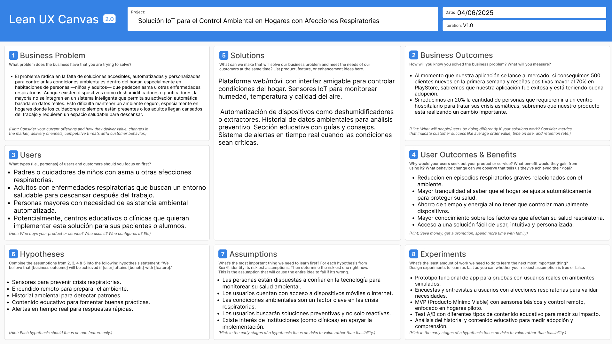

<h1 style="text-align: center;"> Informe del TF  </h1>
<h2 style="text-align: center;"> Universidad Peruana de Ciencias Aplicadas </h2>

<h4 style="text-align: center;"> Ingeniería de Software </h4>
<h4 style="text-align: center;"> Desarrollo de Soluciones IoT </h4>
<h4 style="text-align: center;"> Ciclo 2025-10 </h4>
<h4 style="text-align: center;"> Código del Curso:  </h4>
<h4 style="text-align: center;"> NRC:  </h4>
<h4 style="text-align: center;"> Docente: León Baca, Marco Antonio </h4>
<h4 style="text-align: center;"> Startup:  Error 404 </h4>
<h4 style="text-align: center;"> Producto: Chaki'y  </h4>

## Team Members
|             Nombre              | Código de alumno |
|:-------------------------------:|:----------------:|
|    Guillen Luna, Paolo César    |    U202124343    |
| Sebastian Nicolas, Cachis Gonzales |    U202210846    |
|   Llamo Sánchez, Amner Levi     |    U20221C376    |
|  Cantoral Paredes, Diego André  |    U20201F568    |
|       Elias Yauri Paucar        |    U202211817    |

## Registro de versiones del informe
|   Fecha    | Versión |      Autor      |                                 Descripción de modificación                                 |
|:----------:|:-------:|:---------------:|:-------------------------------------------------------------------------------------------:|
| 06/04/2024 | 1.0     |  Guillen Paolo  | Creación del documento de trabajo en formato markdown junto al realizamiento de la carátula |
| 06/04/2024 | 1.0     |  Sebastian Cachis  | Desarrollo de Hypothesis Statements y UX Canvas |
| 07/04/2024 | 1.0     |  Elias Yauri  | Desarrollo del Registro de entrevistas |

## Project Report Collaboration Insights

URL del repositorio del proyecto: [https://github.com/upc-pre-202401-si730-ws53-Error-404]

## Contenido 
1. [**Capítulo I: Introducción.**](#1.)  
1.1. [***Startup Profile***](#1.1.)  
1.1.1. [Descripción del startup](#1.1.1.) 
1.1.2.[Perfiles de los integrantes del equipo](#1.1.2.) 
1.2. [***Solution Profile***](#1.2.) 
1.2.1. [Antecedentes y Problemática](#1.2.1.) 
1.2.2. [Lean UX Process](#1.2.2.) 
1.2.3. [Lean UX Problem Statements](#1.2.3.) 
1.2.4. [Lean UX Assumptions](#1.2.4.) 
1.2.5. [Lean UX Hypothesis Statements](#1.2.5.) 
1.2.6. [Lean UX Canvas](#1.2.5.) 
1.3. [***Segmentos objetivo***](#1.2.6.) 
2. [**Capítulo II: Requirements Elicitation & Analysis**](#2.) 
2.1. [***Competidores***](#2.1.) 
2.1.1. [Análisis competitivo](#2.1.1.) 
2.1.2. [Estrategias y tácticas frente a competidores](#2.1.2.) 
2.2. [***Entrevistas***](#2.2.) 
2.2.1. [Diseño de entrevistas](#2.2.1.) 
2.2.2. [Registro de entrevistas](#2.2.2.) 
2.2.3. [Análisis de entrevistas](#2.2.3.) 
2.3. [***Needfinding***](#2.3.) 
2.3.1. [User Personas](#2.3.1.) 
2.3.2. [User Task Matrix](#2.3.2.) 
2.3.3. [User Journey Mapping](#2.3.3.) 
2.3.4. [Empathy Mapping](#2.3.4.) 
2.3.5. [As-is Scenario Mapping](#2.3.5.) 
2.4. [***Ubiquitous Language***](#2.4.) 
3. [**Capítulo III: Requirements Specification**](#3.) 
3.1. [***To-Be Scenario Mapping***](#3.1.) 
3.2. [***User Stories***](#3.2.) 
3.3. [***Impact Mapping***](#3.3.) 
3.4. [***Product Backlog***](#3.4.) 
4. [**Capítulo IV: Product Design.**](#4.) 
4.1. [***Style Guidelines***](#4.1.) 
4.1.1. [General Style Guidelines](#4.1.1.) 
4.1.2. [Web Style Guidelines](#4.1.2.) 
4.2. [***Information Architecture***](#4.2.) 
4.2.1. [Organization Systems](#4.2.1.) 
4.2.2. [Labeling Systems](#4.2.2.) 
4.2.3. [SEO Tags and Meta Tags](#4.2.3.) 
4.2.4. [Searching Systems](#4.2.4.) 
4.2.5. [Navigation Systems](#4.2.5.) 
4.3. [***Landing Page UI Design***](#4.3.) 
4.3.1. [Landing Page Wireframe](#4.3.1.) 
4.3.2. [Landing Page Mock-up](#4.3.2.) 
4.4. [***Web Applications UX/UI Design***](#4.4.) 
4.4.1. [Web Applications Wireframes](#4.4.1.) 
4.4.2. [Web Applications Wireflow Diagrams](#4.4.2.) 
4.4.3. [Web Applications Mock-ups](#4.4.3.) 
4.4.4. [Web Applications User Flow Diagrams](#4.4.4.) 
4.5. [***Web Applications Prototyping***](#4.5.) 
4.6. [***Domain-Driven Software Architecture***](#4.6.) 
4.6.1. [Software Architecture Context Diagram](#4.6.1.) 
4.6.2. [Software Architecture Container Diagrams](#4.6.2.) 
4.6.3. [Software Architecture Components Diagrams](#4.6.3.) 
4.7. [***Software Object-Oriented Design***](#4.7.) 
4.7.1. [Class Diagrams](#4.7.1.) 
4.7.2. [Class Dictionary](#4.7.2.) 
4.8. [***Database Design***](#4.8.) 
4.8.1. [Database Diagram](#4.8.1.) 
5. [**Capítulo V: Product Implementation, Validation & Deployment**](#5.) 
5.1. [Software Configuration Management](#5.1.) 
5.1.1. [Software Development Environment Configuration](#5.1.1.) 
5.1.2. [Source Code Management](#5.1.2.) 
5.1.3. [Source Code Style Guide & Conventions](#5.1.3.) 
5.1.4. [Software Deployment Configuration](#5.1.4.) 
5.2. [Landing Page, Services & Applications Implementation](#5.2.) 
5.2.1. [Sprint 1](#5.2.1.) 
5.2.1.1. [Sprint Planning 1](#5.2.1.1.) 
5.2.1.2. [Sprint Backlog 1](#5.2.1.2.) 
5.2.1.3. [Development Evidence for Sprint Review](#5.2.1.3.) 
5.2.1.4. [Testing Suite Evidence for Sprint Review](#5.2.1.4.) 
5.2.1.5. [Execution Evidence for Sprint Review](#5.2.1.5.) 
5.2.1.6. [Services Documentation Evidence for Sprint Review](#5.2.1.6.) 
5.2.1.7. [Software Deployment Evidence for Sprint Review](#5.2.1.7.) 
5.2.1.8. [Team Collaboration Insights during Sprint](#5.2.1.8.) 
5.2.2. [Sprint 2](#5.2.2.) 
5.2.2.1.[Sprint Planning 2](#5.2.2.1.) 
5.2.2.2.[Sprint Backlog 2](#5.2.2.2.) 
5.2.2.3.[Development Evidence for Sprint Review](#5.2.2.3.) 
5.2.2.4.[Testing Suite Evidence for Sprint Review](#5.2.2.4.) 
5.2.2.5.[Execution Evidence for Sprint Review](#5.2.2.5.) 
5.2.2.6.[Services Documentation Evidence for Sprint Review](#5.2.2.6.) 
5.2.2.7.[Software Deployment Evidence for Sprint Review](#5.2.2.7.) 
5.2.2.8.[Team Collaboration Insights during Sprint](#5.2.2.8.) 
5.2.3. [Sprint 3](#5.2.3.) 
5.2.3.1.[Sprint Planning 3](#5.2.3.1.) 
5.2.3.2.[Sprint Backlog 3](#5.2.3.2.) 
5.2.3.3.[Development Evidence for Sprint Review](#5.2.3.3.) 
5.2.3.4.[Testing Suite Evidence for Sprint Review](#5.2.3.4.) 
5.2.3.5.[Execution Evidence for Sprint Review](#5.2.3.5.) 
5.2.3.6.[Services Documentation Evidence for Sprint Review](#5.2.3.6.) 
5.2.3.7.[Software Deployment Evidence for Sprint Review](#5.2.3.7.) 
5.2.3.8.[Team Collaboration Insights during Sprint](#5.2.3.8.) 
5.2.4. [Sprint 4](#5.2.4.) 
5.2.4.1. [Sprint Planning 4](#5.2.4.1.) 
5.2.4.2. [Sprint Backlog 4](#5.2.4.2.) 
5.2.4.3. [Development Evidence for Sprint Review](#5.2.4.3.) 
5.2.4.4. [Testing Suite Evidence for Sprint Review](#5.2.4.4.) 
5.2.4.5. [Execution Evidence for Sprint Review](#5.2.4.5.) 
5.2.4.6. [Services Documentation Evidence for Sprint Review](#5.2.4.6.) 
5.2.4.7. [Software Deployment Evidence for Sprint Review](#5.2.4.7.) 
5.2.4.8. [Team Collaboration Insights during Sprint](#5.2.4.8.) 
5.3. [Validation Interviews](#5.3.) 
5.3.1.[Diseño de Entrevistas](#5.3.1.) 
5.3.2.[Registro de Entrevistas](#5.3.2.) 
5.3.3.[Evaluaciones según Heurísticas](#5.3.3.) 
5.4. [Video About-the-Product](#5.4.) 
6. [**Conclusiones**](#6.) 
7. [**Bibliografía**](#7.) 
8. [**Anexos**](#8.) 

<h2>Capítulo I: Introducción</h2>

<h3> 1.1 Startup Profile</h3>

En esta sección se presenta la descripción del startup y los perfiles de los miembros del equipo.

<h4> 1.1.1. Descripción del startup</h4>

Nuestra startup, Error 404, tiene como misión ofrecer soluciones digitales innovadoras que mejoren la calidad de vida de las personas. A diferencia de otras empresas tecnológicas que apuntan exclusivamente a grandes corporativos, nosotros tenemos una visión inclusiva: queremos ser la opción para todos, desde personas que recién descubren el mundo digital hasta usuarios avanzados que buscan herramientas eficientes para facilitar su día a día.

Para lograrlo, desarrollamos plataformas y dispositivos inteligentes basados en tecnologías como el Internet de las Cosas (IoT) y automatización, con el objetivo de resolver problemas cotidianos de manera práctica y accesible. Creemos que la tecnología no solo debe ser funcional, sino también humana, cercana y útil para el bienestar integral.

**Misión:** . Desarrollar soluciones digitales innovadoras que utilicen tecnologías emergentes, como IoT, para mejorar la calidad de vida de las personas, promoviendo la inclusión tecnológica en todos los niveles de la sociedad.

**Visión:** . Error 404 aspira a convertirse en una startup referente en soluciones tecnológicas aplicadas a la vida cotidiana, reconocida por su capacidad de innovación, su impacto social positivo y su compromiso con una tecnología centrada en las personas.

<h4> 1.1.2. Perfiles de los integrantes del equipo</h4>

|                                                                                                                                                                                                          Descripción de los perfiles de los integrantes del equipo                                                                                                                                                                                                           |                                                              Foto del integrante                                                              |
|:----------------------------------------------------------------------------------------------------------------------------------------------------------------------------------------------------------------------------------------------------------------------------------------------------------------------------------------------------------------------------------------------------------------------------------------------------------------------------:|:---------------------------------------------------------------------------------------------------------------------------------------------:|
| Mi nombre es **Paolo César Guillen Luna**, estudiante de la carrera de Ingeniería de Software, en la UPC y fanático de los videojuegos. Me considero alguien creativo y con determinación en alcanzar sus metas, dentro del campo del desarrollo de software, me gustaría especializarme en lo que es el testing de este, razón por la cual aparte de seguir la malla curricular de mi carrera también ando aprendiendo herramientas diversas como Playwright, Cypress, etc. |      |
| Mi nombre es **Diego André Cantoral Paredes** y soy estudiante de la carrera de Ingeniería de Software. Desde siempre me interesaron los temas tecnológicos y sobre todo las computadoras, por lo que desarrollé una afición a los videojuegos y luego a la programación. Me considero una persona responsable, creativa y siempre dispuesto a ayudar a mis compañeros.|      |
|Mi nombre es **Amner Levi Llamo Sánchez**, soy estudiante del quinto ciclo de ingeniería de software en la UPC. Me gusta jugar fútbol y videojuegos, por eso estoy constantemente investigando sobre nuevas tecnologías. Soy responsable con los trabajos que se me asignan; además soy tolerante y me adapto a las circunstancias del equipo.||
|Mi nombre es **Sebastian Nicolas Cachis Gonzales**, soy estudiante de séptimo ciclo de ingeniería de software en la UPC. Me considero una persona proactiva, organizada, meticulosa y muy enfocada en mis estudios, tanto grupales como individuales. Tengo facilidad para entender y ejemplificar los distintos temas que vemos, teniendo soltura para explicar. |  |
| Mi nombre es **Elias Yauri**, soy una persona muy participativa cuando se trata en el tema laboral y en el trabajo en equipo, siempre trato de que haya una comunicación constante con todos los miembros del grupo para que de esta forma podamos tener toda una buena afinidad como grupo y que el trabajo se realice de manera exitosa.  |  |

<h3> 1.2. Solution Profile</h3>

<h4> 1.2.1. Antecedentes y Problemática</h4>

##### What (Qué)
###### ¿Cuál es el problema?
El problema radica en la falta de soluciones accesibles, automatizadas y personalizadas para controlar las condiciones ambientales dentro del hogar, especialmente en habitaciones de personas —niños y adultos— que padecen asma u otras enfermedades respiratorias. Aunque existen dispositivos como deshumidificadores o purificadores, la mayoría no se integran en un sistema inteligente que permita su activación automática basada en datos reales. Esto dificulta mantener un ambiente seguro, especialmente en hogares donde los cuidadores no siempre están presentes o los adultos llegan cansados del trabajo y requieren un espacio saludable para descansar.

##### When (Cuando)
###### ¿Cuándo sucede el problema?
Este problema se presenta en cualquier momento del día, pero es más crítico durante temporadas de alta humedad o contaminación ambiental, y en horarios en los que el hogar se encuentra sin supervisión directa. También ocurre cuando adultos con asma regresan de una jornada laboral o actividades extenuantes y necesitan descansar en un entorno propicio para su condición respiratoria.

##### Where (Dónde)
###### ¿A dónde se dirige?
Nuestra solución se dirige tanto a familias con niños asmáticos como a adultos que necesitan un entorno saludable tras sus actividades diarias, sin importar su nivel técnico. Se busca facilitar el acceso a un ambiente controlado mediante el uso de tecnología IoT a través de una app web o móvil.

###### ¿Dónde surge el problema?
El problema se origina dentro de los hogares, especialmente en dormitorios o salas donde habitan personas con condiciones respiratorias.

##### Who (Quién)
###### ¿Quiénes están involucrados? ¿Quién lo utilizará?
Los principales usuarios son padres o cuidadores de niños asmáticos, así como adultos que padecen asma u otras afecciones respiratorias y requieren un ambiente controlado. También se incluye a médicos que podrían recomendar el uso de este sistema. El objetivo es brindar autonomía, seguridad y comodidad a quienes sufren estas condiciones, incluso cuando están solos en casa.

##### Why (Por qué)
###### ¿Cuál es la causa del problema?
La principal causa es la ausencia de herramientas automatizadas y accesibles que se integren de forma sencilla al hogar y que brinden monitoreo ambiental en tiempo real. Muchas personas siguen confiando en métodos tradicionales, lo que retrasa la adopción de tecnologías que podrían mejorar considerablemente su calidad de vida. En el caso de adultos trabajadores, muchas veces no tienen el tiempo o energía para gestionar manualmente su entorno cada día.

#### 2H
##### How (Cómo)
###### ¿Cómo se utilizará el producto?
El producto consistirá en una plataforma web/móvil desde la cual el usuario podrá monitorear la temperatura, humedad y calidad del aire de una habitación en tiempo real. Con base en estos datos —recopilados mediante sensores IoT—, se enviarán notificaciones y se activarán automáticamente dispositivos como deshumidificadores, purificadores o extractores de aire. También será posible configurarlo manualmente y personalizarlo según las rutinas del usuario (por ejemplo, que active el sistema antes de que un adulto llegue a casa del trabajo).

###### ¿Cómo se logrará una gestión adecuada del ambiente?
Por medio de sensores IoT distribuidos estratégicamente en la habitación. Estos enviarán datos constantes al sistema, que interpretará los valores y ejecutará acciones en tiempo real. Además, la app brindará recomendaciones basadas en guías médicas (por ejemplo, cuándo ventilar el ambiente, evitar plantas o textiles que acumulen polvo, etc.).

##### How much (Cuánto)
###### ¿Cuál es la magnitud del problema?
La OMS estima que más de 339 millones de personas en el mundo padecen asma, de los cuales una gran parte son adultos que necesitan entornos estables para mantener su salud respiratoria. En Latinoamérica, se estima que entre el 10% y 15% de niños y adultos presentan asma. Además, el 80% de los casos en países en desarrollo se agravan por falta de control ambiental en casa.

Si nuestra solución logra implementarse en solo el 30% de los hogares con personas asmáticas en regiones urbanas, podríamos tener un impacto significativo en la reducción de crisis respiratorias, visitas médicas, y mejorar el descanso diario de los usuarios.

<h4> 1.2.2. Lean UX Process</h4>

<h5> 1.2.2.1. Lean UX Problem Statements</h5>

##### **Problem Statement:** 
Nuestra plataforma, desarrollada por la startup Error 404, nace con el objetivo de brindar soluciones digitales innovadoras que mejoren la calidad de vida de las personas a través de la tecnología. En esta etapa, nos enfocamos en las personas que conviven con enfermedades respiratorias como el asma —tanto niños como adultos— y que requieren de un ambiente saludable y controlado dentro del hogar.

Hoy en día, muchas familias no cuentan con los conocimientos, herramientas o tiempo para controlar adecuadamente las condiciones ambientales de sus hogares. Aunque existen deshumidificadores y purificadores de aire, la falta de integración tecnológica, el monitoreo en tiempo real y la automatización limita su efectividad y uso constante. Además, los adultos que retornan del trabajo o de sus actividades buscan un espacio tranquilo y seguro para subsistir con su condición, pero muchas veces no encuentran el entorno ideal al llegar a casa.

Por otro lado, el desconocimiento sobre la humedad, temperatura o calidad del aire en tiempo real puede desencadenar crisis respiratorias que podrían haberse evitado con alertas o respuestas automáticas del entorno. El reto entonces es: ¿Cómo podemos ofrecer una solución automatizada, intuitiva y confiable que permita a las personas con condiciones respiratorias controlar el ambiente de su hogar, sin necesidad de conocimientos técnicos, y que además funcione de manera preventiva?

Para abordar esta pregunta, necesitamos centrarnos en las siguientes directrices:

* Enfoque centrado en el usuario: La solución debe ser extremadamente fácil de usar, accesible tanto para padres y madres como para adultos mayores o personas con bajo nivel tecnológico.
* Alcance claro: Nos centraremos en la gestión del ambiente del hogar (humedad, temperatura y calidad del aire), excluyendo otros factores como el control médico o diagnóstico clínico.
* Medidas de éxito: El éxito se medirá por la reducción en los episodios respiratorios relacionados al ambiente, el aumento del confort de los usuarios al llegar a casa, y la adopción sostenida de la herramienta por parte de las familias
* Al plantear esta necesidad de forma abierta, dejamos espacio para explorar soluciones que integren tecnología IoT, interfaces amigables, automatización y educación preventiva. Lo fundamental es asegurar que la solución no solo funcione, sino que también genere confianza y se perciba como un verdadero apoyo en la vida diaria de quienes viven con asma.

##### **User Assumptions:**
###### **¿Quién es el usuario?**

El usuario de nuestro producto son personas con asma o afecciones respiratorias, principalmente niños que necesitan un ambiente saludable en el hogar y adultos que, tras una jornada laboral o de actividades, buscan un espacio adecuado para descansar y cuidar su salud. En muchos casos, los usuarios también son padres o cuidadores que desean garantizar un entorno óptimo para sus hijos. Si el producto tiene éxito, también podría ser adoptado por instituciones como centros educativos, clínicas o residencias.

###### **¿Qué problemas tiene nuestro producto? ¿Qué resuelve?**

El problema central que aborda nuestro producto es la falta de monitoreo y control en tiempo real de las condiciones ambientales dentro del hogar, lo cual puede desencadenar crisis respiratorias en personas con asma. Nuestra solución utiliza tecnología IoT para detectar niveles no adecuados de humedad o temperatura y automatizar la activación de deshumidificadores u otros dispositivos, todo controlado desde una aplicación web o móvil accesible y fácil de usar.

###### **¿Qué características son importantes?**

Entre las características más relevantes se encuentran:

- **Automatización del ambiente** mediante sensores IoT.
- **Control remoto** de dispositivos como deshumidificadores desde una app web/móvil.
- **Alertas inteligentes** cuando los niveles de humedad o temperatura no son óptimos.
- **Historial de condiciones ambientales** para prevenir futuras crisis.
- **Accesibilidad y facilidad de uso**, sin requerir conocimientos técnicos.

###### **¿Dónde encaja nuestro producto en su trabajo o vida?**

Nuestro producto encaja directamente en la rutina diaria del usuario, ya que mejora significativamente el ambiente del hogar. Ayuda a garantizar que, al volver a casa luego del trabajo o al cuidar de un niño, el entorno esté adaptado para evitar complicaciones respiratorias. También se integra como una herramienta de apoyo constante, tanto en situaciones preventivas como reactivas.

###### **¿Cuándo y cómo es nuestro producto usado?**

El sistema puede usarse de manera automática cuando los sensores detectan condiciones desfavorables o manualmente cuando el usuario desea preparar el ambiente (por ejemplo, antes de llegar a casa). El uso puede ser frecuente, especialmente en horas clave como la noche, el amanecer o tras actividades físicas que agraven síntomas respiratorios.

###### **¿Cómo debe verse nuestro producto y cómo debe comportarse?**

Debe tener una interfaz amigable, clara y empática, con diseño pensado para personas de todas las edades. Su comportamiento debe ser predecible, proactivo y seguro: debe actuar ante riesgos ambientales, proteger los datos del usuario y permitir una experiencia sin frustraciones. Además, debe transmitir confianza y tranquilidad en todo momento.

##### **Feature Assumptions:**

**Creemos que** al integrar sensores de calidad del aire y humedad, los usuarios podrán evitar crisis asmáticas antes de que ocurran, mejorando su calidad de vida.

**Creemos que** al permitir el encendido remoto de deshumidificadores, los usuarios podrán preparar el ambiente antes de llegar a casa, asegurando un entorno saludable desde el inicio.

**Creemos que** incluir un historial ambiental ayudará a identificar patrones que afectan la salud respiratoria y tomar decisiones preventivas más informadas.

**Creemos que** una sección educativa con consejos y guías sobre cómo mantener un ambiente saludable fomentará una comunidad más informada y comprometida con el autocuidado.

**Creemos que** implementar un sistema de alertas en tiempo real ante condiciones críticas permitirá respuestas rápidas que prevengan crisis respiratorias, especialmente en niños.

<h5> 1.2.2.5. Lean UX Hypothesis Statements.</h5>

Hipótesis 1: Sensores para evitar crisis asmáticas

**Creemos que** al integrar sensores de calidad del aire y humedad en el hogar, los usuarios podrán evitar crisis asmáticas antes de que ocurran, mejorando su calidad de vida.
**Sabremos que hemos tenido éxito cuando** los usuarios reporten una disminución en la frecuencia de crisis respiratorias y manifiesten sentirse más seguros en sus hogares.

Hipótesis 2: Encendido remoto del sistema

**Creemos que** al permitir el encendido remoto de deshumidificadores y otros dispositivos, los usuarios podrán preparar el ambiente antes de llegar a casa, asegurando un entorno saludable desde el inicio.
**Sabremos que hemos tenido éxito cuando** los usuarios utilicen frecuentemente esta función y expresen satisfacción con las condiciones del ambiente al llegar a casa.

Hipótesis 3: Historial de condiciones ambientales

**Creemos que** al incluir un historial de condiciones ambientales, los usuarios podrán identificar patrones que afectan su salud respiratoria y tomar decisiones preventivas más informadas.
**Sabremos que hemos tenido éxito cuando** los usuarios consulten regularmente el historial y realicen ajustes en sus rutinas o configuraciones basados en los datos registrados.

Hipótesis 4: Contenido educativo dentro de la app

**Creemos que** incluir una sección educativa con consejos y guías fomentará una comunidad más informada y comprometida con el autocuidado.
**Sabremos que hemos tenido éxito cuando** los usuarios accedan frecuentemente a esta sección y demuestren cambios positivos en sus hábitos relacionados al ambiente del hogar.

Hipótesis 5: Alertas en tiempo real

**Creemos que** implementar un sistema de alertas en tiempo real ante condiciones críticas permitirá respuestas rápidas que prevengan crisis respiratorias, especialmente en niños.
**Sabremos que hemos tenido éxito cuando** los usuarios reaccionen ante las alertas y estas acciones se correlacionen con una disminución en episodios respiratorios reportados.

<h5> 1.2.2.6. Lean UX Canvas.</h5>

<h3> 1.3. Segmento Objetivo</h3>

Adultos que sufren de asma o afecciones respiratorias: Personas que necesitan un entorno controlado y saludable en su hogar para mejorar su calidad de vida y reducir los síntomas relacionados con el asma.

Niños y padres de niños con asma, así como personas que padecieron asma en su niñez: Padres o cuidadores que buscan garantizar un ambiente seguro y saludable para sus hijos, o adultos que vivieron con asma durante su infancia y desean mantener un entorno controlado para prevenir futuros episodios.

<h2>Capítulo II: Requirements Elicitation & Analysis</h2>

<h3> 2.1 Competidores</h3>

|Competitive Analysis Landscape|   |   |   |   |   |
|--------------------------------|---|---|---|---|---|
|¿Por qué llevar a cabo este análisis?|Escriba en el recuadro la pregunta que busca responder o el objetivo de este análisis.|   |   |   |   |
|(En la cabecera colocar por cada competidor nombre y logo)|   |Chaki'y|AirVisual  |Awair |Nest Thermostat (Google) |
|Perfil|Overview|Solución IoT para controlar el aire, humedad y temperatura en hogares de personas con asma.|Sensor de calidad del aire para monitorear contaminación y condiciones ambientales.|Dispositivo IoT para monitorear y controlar la calidad del aire y el ambiente en el hogar.|Termostato inteligente que regula temperatura y humedad para optimizar el hogar.|
|                                |Ventaja competitiva ¿Qué valor ofrece a los clientes?|Proporciona un control automático y preventivo del ambiente para mejorar la salud respiratoria de personas con asma.|Ofrece monitoreo en tiempo real de la calidad del aire para crear un ambiente más saludable.|Brinda control y monitoreo del ambiente para mejorar el bienestar general del hogar.|Regula temperatura y humedad de manera inteligente, optimizando el confort y la eficiencia energética.|
|Perfil de Marketing|Mercado objetivo|Familias con niños asmáticos, adultos con asma y cuidadores que buscan un ambiente controlado en casa.|Personas preocupadas por la calidad del aire, en hogares urbanos o áreas con alta contaminación.|Hogares interesados en mejorar el bienestar ambiental y la calidad del aire en espacios cerrados.|Propietarios de viviendas que buscan eficiencia energética y automatización del hogar para mejorar el confort.|
|                                |Estrategias de marketing|Enfoque en educación sobre salud respiratoria, alianzas con médicos y clínicas, marketing en redes sociales dirigido a padres y cuidadores.|Publicidad en plataformas relacionadas con la sostenibilidad y la salud ambiental, marketing de contenido sobre la calidad del aire.|Estrategias de influencers en el bienestar y hogar, campañas de concienciación sobre la calidad del aire en interiores.|Publicidad centrada en la eficiencia energética y el ahorro, promoción de la integración con dispositivos Google y otros productos smart home.|
|Perfil de Producto|Productos & Servicios|Plataforma IoT para monitoreo y control de calidad del aire, humedad y temperatura en hogares de personas con asma. Servicios de integración con dispositivos como deshumidificadores y purificadores.|Sensor de calidad del aire con app que muestra datos sobre contaminación, temperatura y humedad. Servicios de monitoreo ambiental en tiempo real.|Dispositivo IoT para monitoreo de la calidad del aire, temperatura y humedad en interiores, con una app para controlar y gestionar el ambiente.|Termostato inteligente para regular temperatura y humedad, optimizando la eficiencia energética y la comodidad del hogar. Servicios de integración con otros dispositivos smart home.|
|                                |Precios & Costos|El producto posee deshumidificador y sensores por lo que se estima un precio aproximadamente de 140 dolares.|Este sensor de calidad del aire tiene un precio aproximado de $199.|El dispositivo para monitorear la calidad del aire tiene un costo aproximado de $199.|El termostato inteligente tiene un precio aproximado de $130.|
|                                |Canales de distribución (Web y/o Móvil)|Plataforma disponible en web y móvil para monitorear y controlar la calidad del aire, temperatura y humedad en el hogar, mediante dispositivos IoT, dirigida a personas con afecciones respiratorias.|Aplicación móvil para la gestión agrícola, proporcionando herramientas para monitoreo de cultivos, control de plagas y análisis de datos en tiempo real, mejorando la eficiencia en la agricultura.|Plataforma disponible en web y móvil para la reserva de espacios de estacionamiento en garajes privados, facilitando a los usuarios la búsqueda y reserva de lugares disponibles de forma rápida y conveniente.|Plataforma financiera en web y móvil que ofrece asesoramiento personalizado y servicios de inversión para empresas y tiendas independientes, con el objetivo de optimizar el ahorro y maximizar el crecimiento financiero.|
|Análisis SWOT|Fortalezas|Plataforma web y móvil que permite monitorear y controlar la calidad del aire, temperatura y humedad en el hogar mediante dispositivos IoT, dirigida a personas con afecciones respiratorias.|Dispositivo y app móvil para monitoreo de calidad del aire en tiempo real, proporcionando alertas sobre la contaminación ambiental y recomendaciones para mejorar la salud respiratoria.|Sensor de calidad del aire que se conecta a una app móvil para brindar información sobre la calidad del aire interior, ayudando a mejorar el ambiente y la salud respiratoria en el hogar o en el trabajo.|Termostato inteligente con conexión a una app móvil que permite controlar la temperatura de la vivienda de forma eficiente, optimizando el uso de energía y mejorando el confort interior.|
|                                |Debilidades|Dependencia de la conectividad y la infraestructura IoT, requiere dispositivos adicionales para funcionar completamente.|	Puede depender de la calidad de la red de sensores en ciertas ubicaciones; algunos usuarios pueden encontrar la app difícil de usar.|	Limitado en cuanto a la cantidad de datos que puede procesar comparado con dispositivos más avanzados; costoso para algunos usuarios.|Requiere conexión Wi-Fi constante y podría no ser compatible con todos los sistemas HVAC. Además, no se adapta a todas las configuraciones de hogar.|
|                                |Oportunidades|Expansión a mercados con alta prevalencia de afecciones respiratorias, desarrollo de nuevos sensores IoT y asociaciones con instituciones de salud.|	Creciente conciencia sobre la contaminación del aire, expansión a mercados internacionales y adopción en hogares y oficinas.|Creciente demanda de soluciones para mejorar la calidad del aire en interiores, posibles asociaciones con empresas de salud y bienestar.|Expansión de hogares inteligentes y ecosistemas IoT, oportunidades en hogares y oficinas para mejorar la eficiencia energética.|
|                                |Amenazas|Competencia creciente en el mercado de dispositivos IoT para la salud, barreras de adopción tecnológica en ciertos segmentos.|	Competencia con dispositivos más avanzados de monitoreo ambiental, fluctuaciones en la demanda debido a la percepción de costo elevado.|Avances rápidos en tecnologías de monitoreo de aire, nuevos competidores con funcionalidades más económicas o avanzadas.|	Competencia en el mercado de termostatos inteligentes (incluyendo opciones más económicas), posibles problemas con la compatibilidad de dispositivos en hogares antiguos.|

<h4> 2.1.1. Análisis competitivo</h4>

Chaki'y se diferencia de sus competidores al integrar IoT para monitorear y automatizar dispositivos como deshumidificadores y purificadores, mejorando la calidad del aire y la temperatura en el hogar de personas con afecciones respiratorias. A diferencia de AirVisual y Awair, que se centran solo en el monitoreo de la calidad del aire, Chaki'y ofrece una solución más completa al automatizar la respuesta a los cambios ambientales. Nest Thermostat, aunque optimiza la temperatura y la eficiencia energética, no está diseñado para abordar específicamente las necesidades de personas con afecciones respiratorias.

El mercado objetivo de Chaki'y está enfocado en personas con afecciones respiratorias, como niños y adultos con asma, y sus cuidadores. En contraste, AirVisual y Awair están dirigidos a usuarios interesados en la calidad del aire en general, sin un enfoque especializado en problemas respiratorios. Nest Thermostat está destinado a quienes buscan eficiencia energética, pero no se centra en las necesidades de los usuarios con problemas respiratorios.

En términos de precios, Chaki'y ofrece una versión gratuita que facilita su acceso a un público más amplio, mientras que los competidores AirVisual, Awair y Nest Thermostat son productos premium, lo que limita su accesibilidad. Chaki'y tiene una ventaja competitiva al ser más accesible, especialmente para aquellos que no están seguros de realizar una inversión inicial.

Chaki'y tiene una gran oportunidad de capitalizar su enfoque especializado en afecciones respiratorias y su integración con dispositivos IoT para crear un ambiente más saludable. Aunque AirVisual y Awair son productos avanzados en el monitoreo del aire, la automatización de Chaki'y le da una ventaja clara. Nest Thermostat, con su enfoque en eficiencia energética, representa una amenaza, pero su falta de enfoque en la calidad del aire lo hace menos adecuado para personas con afecciones respiratorias. En general, Chaki'y está bien posicionado para liderar este nicho de mercado.

<h4> 2.1.2. Estrategias y tácticas frente a competidores</h4>

Chaki'y debe destacarse de sus competidores como AirVisual, Awair y Nest Thermostat mediante su diferenciación como una solución IoT integral para la mejora de la calidad del aire y el control de la temperatura, orientada específicamente a personas con afecciones respiratorias. Su enfoque en automatizar dispositivos como deshumidificadores y purificadores, junto con su modelo accesible de precios, la posiciona como una alternativa más completa frente a competidores que solo ofrecen monitoreo. Además, Chaki'y debe continuar promoviendo su nicho de mercado, centrado en el bienestar respiratorio, y utilizar estrategias de precios con opciones gratuitas y premium para atraer a una mayor variedad de usuarios.

En cuanto a las tácticas, Chaki'y debería centrarse en campañas educativas sobre la importancia de la calidad del aire, aprovechar alianzas estratégicas con organizaciones de salud para aumentar su credibilidad, y continuar invirtiendo en la automatización de su tecnología. También puede incentivar la adopción a través de pruebas gratuitas y aprovechar testimonios de usuarios satisfechos. Finalmente, debe desarrollar campañas de marketing dirigidas específicamente a personas con afecciones respiratorias, destacando cómo su solución mejora la calidad de vida de los usuarios. Estas estrategias permitirán a Chaki'y competir eficazmente en el mercado, atraer a nuevos usuarios y fortalecer su posición frente a competidores.

<h3> 2.2 Entrevistas</h3>

<h4> 2.2.1. Diseño de entrevistas</h4>

### Segmento 1: Adultos que sufren de asma o problemas respiratorios

1. ¿Cuánto tiempo hace que tienes asma o alguna afección respiratoria?
2. ¿Cómo manejas tus síntomas asmáticos a lo largo del día?
3. ¿Qué herramientas o dispositivos usas actualmente para controlar el ambiente de tu hogar (temperatura, humedad, calidad del aire)?
4. ¿Con qué frecuencia te encuentras con crisis asmáticas o problemas respiratorios debido a factores ambientales?
5. ¿Crees que el monitoreo de la calidad del aire y la temperatura en tu hogar ayudaría a reducir tus síntomas?
6. ¿Estarías dispuesto a usar una aplicación móvil que controle la calidad del aire y la temperatura de tu hogar?
7. ¿Qué características valoras más en una herramienta que te ayude a gestionar tu condición respiratoria?
8. ¿Cómo te sentirías al integrar dispositivos inteligentes en tu hogar para mejorar tu salud respiratoria?
9. ¿Estarías dispuesto a pagar por una herramienta como Chaki'y si mejora tu calidad de vida?

### Segmento 2: Niños/Padres con niños que sufren de asma o personas que sufrieron de asma en su niñez

1. ¿Recuerdas cómo tus padres manejaron las crisis asmáticas que tuviste en la niñez?
2. ¿Qué tipo de soluciones usaban tus padres para mejorar la calidad del aire en tu hogar durante esos episodios?
3. ¿Crees que los padres de hoy enfrentan los mismos retos para controlar el asma de sus hijos que los padres de tu generación?
4. ¿Crees que una herramienta como Chaki'y, que monitorea el aire y la temperatura, sería útil para los padres de niños asmáticos hoy en día?
5. ¿Cómo manejabas el control de tu salud respiratoria cuando eras más joven? ¿Qué tecnología utilizabas (si alguna)?
6. ¿Qué opinas de las soluciones tecnológicas actuales para el control del asma infantil?
7. ¿Estarías dispuesto a usar una aplicación móvil como Chaki'y para monitorear la calidad del aire en casa de tus hijos?
8. ¿Qué características consideras más importantes en una herramienta que los padres puedan usar para gestionar la salud respiratoria de sus hijos?
9. ¿Crees que los padres actuales estarían dispuestos a pagar por un dispositivo o aplicación que controle el ambiente de su hogar y mejore la salud respiratoria de sus hijos?

<h4> 2.2.2. Registro de entrevistas</h4>

***Adultos que sufren de asma o problemas respiratorios***

|Nombre entrevistado|Rodrigo Pisconti|
|-|-|
|Edad|20 años|
|Departamento|Ica, Ica|
||Rodrigo Pisconti, un joven de 20 años que sufrió de asma durante su niñez, actualmente sigue siendo sensible a factores ambientales como la humedad y el polvo. Aunque sus síntomas se han reducido, aún experimenta molestias respiratorias varias veces al mes. Usa un deshumidificador y medidores manuales de ambiente, pero no cuenta con tecnología automatizada. Mostró interés en una herramienta que le permita monitorear y controlar el ambiente de su hogar de forma preventiva. Destaca la importancia de la simplicidad, confiabilidad y automatización. Rodrigo se mostró dispuesto a integrar dispositivos inteligentes y pagar por una solución como Chaki’y si mejora su bienestar.|
|Duración entrevista: 00:00-05:38 |URL: [https://upcedupe-my.sharepoint.com/:v:/g/personal/u202211817_upc_edu_pe/EQ7Z-iPKJpNMiwI9G_hAp3gBT6usQq9D6iSu4Ut-Hm2ADg?nav=eyJyZWZlcnJhbEluZm8iOnsicmVmZXJyYWxBcHAiOiJTdHJlYW1XZWJBcHAiLCJyZWZlcnJhbFZpZXciOiJTaGFyZURpYWxvZy1MaW5rIiwicmVmZXJyYWxBcHBQbGF0Zm9ybSI6IldlYiIsInJlZmVycmFsTW9kZSI6InZpZXcifX0%3D&e=L2Kz8N]|

***Niños/Padres con niños que sufren de asma o personas que sufrieron de asma en su niñez***

|Nombre entrevistado|Carla Cachis|
|-|-|
|Edad|28 años|
|Departamento|Lima, Lima|
||Carla Cachis, una señorita de 28 años, nos cuenta su experiencia cuando era niña y sufrió de asma. Ella nos contó que sus padres se lo detectaron a los 4 años, desde entonces sus padres tomaban precauciones para poder evitar que este fuera a más. Hacían uso de deshumidificadores y los dispositivos que tenían en esos años; cabe comentar que la oferta era escaza. Nos comenta que si estaría interesada en poder contar con un aplicativo, que pueda darte la información del porcentaje de humedad en tu hogar mediante notificaciones y que la aplicación sea gratuita, pero que su costo esté incluido en los productos y sensores |
|Duración entrevista: 00:00-09:47    |URL: [https://upcedupe-my.sharepoint.com/:v:/g/personal/u202210846_upc_edu_pe/EU5EjdDTp9pGhGoEzsWx5FkBvXFCrdoFIzZ6YdkzQH4doQ?nav=eyJyZWZlcnJhbEluZm8iOnsicmVmZXJyYWxBcHAiOiJTdHJlYW1XZWJBcHAiLCJyZWZlcnJhbFZpZXciOiJTaGFyZURpYWxvZy1MaW5rIiwicmVmZXJyYWxBcHBQbGF0Zm9ybSI6IldlYiIsInJlZmVycmFsTW9kZSI6InZpZXcifX0%3D&e=KIQu3Y]|

<h4> 2.2.3. Análisis de entrevistas</h4>

**Análisis del segmento de Adultos que sufren de asma o problemas respiratorios**

**Análisis del segmento de Niños/Padres con niños que sufren de asma o personas que sufrieron de asma en su niñez**

<h3> 2.3 Needfinding</h3>

<h4> 2.3.1. User Personas</h4>

<h4> 2.3.2. User Task Matrix</h4>

<h4> 2.3.3. User Journey Mapping</h4>

<h4> 2.3.4. Empathy Mapping</h4>

<h4> 2.3.5. As-is Scenario Mapping</h4>

<h3> 2.4 Ubiquitous Language</h3>

<h2>Bibliografía</h2>

Organización Mundial de la Salud (OMS). (2021). Asma. Recuperado de [https://www.who.int/es/news-room/fact-sheets/detail/asthma]

UNICEF. (2020). El entorno saludable: clave para la salud infantil. Recuperado de [https://www.unicef.org]

GINA - Global Initiative for Asthma. (2023). Global Strategy for Asthma Management and Prevention. Recuperado de [https://ginasthma.org]

Science Magazine. (2020). Digital health adoption in emerging countries: A systematic review. Recuperado de [https://www.science.org]

<h2>Anexos</h2>

